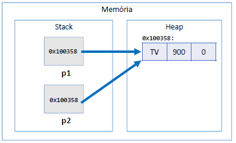
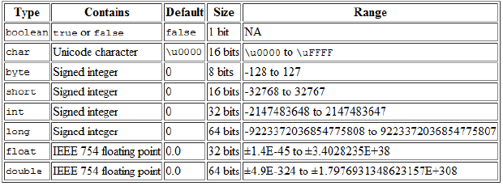
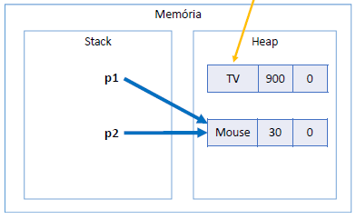

## CAPÍTULO 10 - Memória, Arrays e Listas

### Mémoria
- Projeto
	- Mod02
	- Método
- Tipos referência vs. tipos valor
```
Product p1, p2;
p1 = new Product("TV", 900.00, 0);
p2 = p1;
```

- Tipos primitivos são tipos valor
	- Tipos primitivos ficam na Stack
```
double x, y;
x = 10;
y = x;
```

- Quando alocamos (new) qualquer tipo estruturado (classe ou array), são atribuídos valores padrão os seus elementos
	- números: 0
	- boolean: false
	- char: caractere código 0
	- objeto: null
		- p -> name=null, price=0.0, quantity=0
#### Tipos referência vs. tipos valor

|CLASSE |TIPO PRIMITIVO|
| :---: | :----------: |
|Vantagem: usufrui de todos recursos OO |Vantagem: é mais simples e mais performático|
|Variáveis são ponteiros |Variáveis são caixas|
|Objetos precisam ser instanciados usando new, ou apontar para um objeto já existente.| Não instancia. Uma vez declarados, estão prontos para uso.|
|Aceita valor null |Não aceita valor null|
|Y = X; "Y passa a apontar para onde X aponta"| Y = X; "Y recebe uma cópia de X"|
|Objetos instanciados no heap |"Objetos" instanciados no stack|
|Objetos não utilizados são desalocados em um momento próximo pelo garbage collector |"Objetos" são desalocados imediatamente quando seu escopo de execução é finalizado|

#### Garbage collector
- É um processo que automatiza o gerenciamento de memória de um programa em execução
- O garbage collector monitora os objetos alocados dinamicamente pelo programa (no heap), desalocando aqueles que não estão mais sendo utilizados.
- Desalocação por garbage collector
```
Product p1, p2;
p1 = new Product("TV", 900.00, 0);
p2 = new Product("Mouse", 30.00, 0);

p1 = p2;
```


- Desalocação por escopo
	 - A variável só vai existir enquanto estiver no seu escopo
#### Resumo
- Objetos alocados dinamicamente, quando não possuem mais referência para eles, serão desalocados pe
lo garbage collector 
- Variáveis locais são desalocadas imediatamente assim que seu escopo local sai de execução

### Vetores
- Em programação, "vetor" é o nome dado a arranjos unidimensionais
- Arranjo (array) é uma estrutura de dados:
	- Homogênea (dados do mesmo tipo)
	- Ordenada (elementos acessados por meio de posições)
	- Alocada de uma vez só, em um bloco contíguo de memória
- Vantagens:
	- Acesso imediato aos elementos pela sua posição
- Desvantagens:
	- Tamanho fixo
	- Dificuldade para se realizar inserções e deleções
