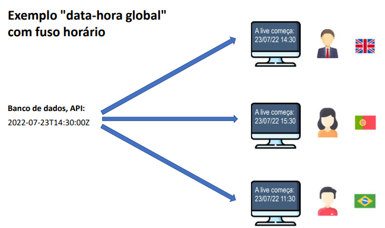

## CAPÍTULO 11 - Trabalhando com datas

### Conceitos importantes
- Data-[hora] local:
	- ano-mês-dia-[hora] sem fuso horário
	- [hora] opcional • Data-hora global:
	- ano-mês-dia-hora com fuso horário
- Duração:
	- tempo decorrido entre duas data-horas


##
### Quando usar?
- Data-[hora] local:
	- Quando o momento exato não interessa a pessoas de outro fuso horário.
	- Uso comum: sistemas de região única, Excel.
		- Data de nascimento: "15/06/2001"
		- Data-hora da venda: "13/08/2022 às 15:32" (presumindo não interessar fuso horário) 
- Data-hora global:
	- Quando o momento exato interessa a pessoas de outro fuso horário.
	- Uso comum: sistemas multi-região, web.
		- Quando será o sorteio? "21/08/2022 às 20h (horário de São Paulo)"
		- Quando o comentário foi postado? "há 17 minutos"
		- Quando foi realizada a venda? "13/08/2022 às 15:32 (horário de São Paulo)"
		- Início e fim do evento? "21/08/2022 às 14h até 16h (horário de São Paulo)"
##
### Timezone (fuso horário) 
- GMT - Greenwich Mean Time **BASE**
    - Horário de Londres
    - Horário do padrão UTC - Coordinated Universal Time
    - Também chamado de "Z" time, ou Zulu time
- Outros fuso horários são relativos ao GMT/UTC: 
    - São Paulo: GMT-3
    - Manaus: GMT-4
    - Portugal: GMT+1
- Muitas linguagens/tecnologias usam nomes para as timezones: 
    - "US/Pacific"
    - "America/Sao_Paulo"
    - etc.
##
### Padrão ISO 8601
- Data-[hora] local:
    - 2022-07-21
    - 2022-07-21T14:52
    - 2022-07-22T14:52:09
    - 2022-07-22T14:52:09.4073
- Data-hora global:
    - 2022-07-23T14:52:09Z
    - 2022-07-23T14:52:09.254935Z
    - 2022-07-23T14:52:09-03:00
- *Z* mesmo GMT e UTC
##
### Operações importantes com data-hora
- Instanciação
    - (agora) ➞ Data-hora
    - Texto ISO 8601 ➞ Data-hora
    - Texto formato customizado ➞ Data-hora
    - dia, mês, ano, [horário] ➞ Data-hora local 
- Formatação
    - Data-hora ➞ Texto ISO 8601
    - Data-hora ➞ Texto formato customizado
##
### Operações importantes com data-hora
- Converter data-hora global para local 
    - Data-hora global, timezone (sistema local) ➞Data-hora local 
- Obter dados de uma data-hora local 
    - Data-hora local ➞ dia, mês, ano, horário
- Cálculos com data-hora
    - Data-hora +/- tempo ➞ Data-hora
    - Data-hora 1, Data-hora 2 ➞ Duração
##
### Principais tipos Java (versão 8+) 
- Data-hora local
    - LocalDate
    - LocalDateTime
- Data-hora global
    - Instant 
- Duração
    - Duration
- Outros
    - ZoneId
    - ChronoUnit

### Projeto
	- Mod02
	- Método
		- datas()
- Um objeto Date internamente armazena:
	- O número de milissegundos desde a meia noite do dia 1 de janeiro de 1970 GMT (UTC)
	- GMT: Greenwich Mean Time (time zone)
	- UTC: Coordinated Universal Time (time standard)
- **SimpleDateFormat**
	- [Documentação](https://docs.oracle.com/javase/10/docs/api/java/text/SimpleDateFormat.html)
		- Define formatos para conversão entre Date e String
		- dd/MM/yyyy -> 23/07/2018
		- dd/MM/yyyy HH:mm:ss -> 23/07/2018 15:42:07
- **Padrão ISO 8601 e classe Instant**
	- Formato: yyyy-MM-ddTHH:mm:ssZ
	- Exemplo: "2018-06-25T15:42:07Z"
	- Date y3 = Date.from(Instant.parse("2018-06-25T15:42:07Z"));
#### Manipulando uma data com Calendar
- Somando uma unidade de tempo
	- Método: usandoCalendar()

```
public static void usandoCalendar(){
		SimpleDateFormat sdf = new SimpleDateFormat("dd/MM/yyyy HH:mm:ss");
		Date d = Date.from(Instant.parse("2018-06-25T15:42:07Z"));
		Calendar cal = Calendar.getInstance();
	
		cal.setTime(d);
		cal.add(Calendar.HOUR_OF_DAY, 4);
		d = cal.getTime();
		int minutes = cal.get(Calendar.MINUTE);
		int month = 1 + cal.get(Calendar.MONTH);
		
		System.out.println(sdf.format(d));							// 25/06/2018 12:42:07
		System.out.println("Minutes: "+minutes);				// Minutes: 42
		System.out.println("Month: "+month);						// Month: 6
	}
```

## Referências
- https://docs.oracle.com/en/java/javase/17/docs/api/java.base/java/time/format/DateTimeFormatter.html