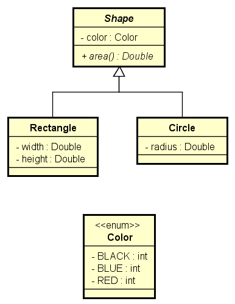

## HERANÇA E POLIMORFISMO

- [Composições e Enumerações](../13_Enumeracoes_Composicoes/README.md)
### Herança
- É um tipo de associação que permite que uma classe herde todos dados e comportamentos de outra
	- Definições importantes
	- Vantagens
	- Reuso
	- Polimorfismo
	- Sintaxe
	- class A extends B
- Diagrama herança


	- Relação "é-um"
		- Conta empresarial ela é uma conta só que com algo mais
	- Generalização/especialização
		- Classe Conta é Generalização, quanto que a Conta Empresarial é uma especialização
	- Superclasse (classe base) / subclasse (classe derivada)
	- Herança / extensão
	- Herança é uma associação entre classes (e não entre objetos)
	
#### Upcasting e Downcasting
- Upcasting
	- Casting da subclasse para superclasse
	- Uso comum: polimorfismo
- Downcasting
	- Casting da superclasse para subclasse
	- Palavra instanceof
	- Uso comum: métodos que recebem parâmetros genéricos (ex: Equals)
- Upcasting e Downcasting Exemplo


- Projeto Heranca_Polimorfismo
	- Program
```
Account acc = new Account(1001, "Alex", 0.0);
BusinessAccount bacc = new BusinessAccount(1002, "Maria", 0.0, 500.0);

// UPCASTING
Account acc1 = bacc;
Account acc2 = new BusinessAccount(1003, "Bob", 0.0, 200.0);
Account acc3 = new SavingsAccount(1004, "Anna", 0.0, 0.01);

// DOWNCASTING
BusinessAccount acc4 = (BusinessAccount)acc2;
acc4.loan(100.0);

// BusinessAccount acc5 = (BusinessAccount)acc3;
// Verifica se acc3 é instância de BusinessAccount
if (acc3 instanceof BusinessAccount) {
	BusinessAccount acc5 = (BusinessAccount)acc3;
	acc5.loan(200.0);
	System.out.println("Loan!");
}

if (acc3 instanceof SavingsAccount) {
	SavingsAccount acc5 = (SavingsAccount)acc3;
	acc5.updateBalance();
	System.out.println("Update!");
}
```
### Sobreposição, palavra super, anotação @Override
- Sobreposição ou sobrescrita
	- É a implementação de um método de uma superclasse na subclasse
	- É fortemente recomendável usar a anotação @Override em um método sobrescrito
		- Facilita a leitura e compreensão do código
		- Avisamos ao compilador (boa prática)

		

- Suponha que a operação de saque possui uma taxa no valor de 5.0. Entretanto, se a conta for do tipo poupança, esta taxa não deve ser cobrada.
- Como resolver isso?
- Resposta: sobrescrevendo o método withdraw na subclasse SavingsAccount
- **Account:**
```
public void withdraw(double amount) {
	balance -= amount + 5.0;
}
```
- **SavingsAccount:**
```
@Override
public void withdraw(double amount) {
	balance -= amount;
}
```
##### Palavra super
- É possível chamar a implementação da superclasse usando a palavra super. 
- Exemplo: suponha que, na classe BusinessAccount, a regra para saque seja realizar o saque normalmente da superclasse, e descontar mais 2.0.
```
@Override
public void withdraw(double amount) {
	super.withdraw(amount);
	balance -= 2.0;
}
```
##### Classes e métodos final
- Palavra chave: final
- Classe: evita que a classe seja herdada
```public final class SavingsAccount {```
- Método: evita que o método sob seja sobreposto
```
@Override
	public final void withdraw(double amount) {
	balance -= amount;
}
```
##### Pra quê?
- Segurança: dependendo das regras do negócio, às vezes é desejável garantir que uma classe não seja herdada, ou que um método não seja sobreposto.
	- Geralmente convém acrescentar final em métodos sobrepostos, pois sobreposições múltiplas podem ser uma porta de entrada para
inconsistências
- Performance: atributos de tipo de uma classe final são analisados de forma mais rápida em tempo de execução.
	- Exemplo clássico: String
	
### Polimorfismo

##### Pilares da OOP
- Encapsulamento
- Herança
- Polimorfismo
	- Em Programação Orientada a Objetos, polimorfismo é recurso que permite que variáveis de um mesmo tipo mais genérico possam apontar para objetos de tipos específicos diferentes, tendo assim comportamentos diferentes conforme cada tipo específico.
```
Account x = new Account(1020, "Alex", 1000.0);
Account y = new SavingsAccount(1023, "Maria", 1000.0, 0.01);

x.withdraw(50.0);
y.withdraw(50.0);
```
	
- A associação do tipo específico com o tipo genérico é feita em tempo de execução (upcasting).
- O compilador não sabe para qual tipo específico a chamada do método Withdraw está sendo feita (ele só sabe que são duas variáveis tipo Account):

##### Exercício 01
- Projeto Employee
	- Exer07-polimorfismo


##### Resumo
- Uma empresa possui funcionários próprios e terceirizados. Para cada funcionário, deseja-se registrar nome, horas trabalhadas e valor por hora. Funcionários terceirizado possuem ainda uma despesa adicional.
- O pagamento dos funcionários corresponde ao valor da hora multiplicado pelas horas trabalhadas, sendo que os funcionários terceirizados ainda recebem um bônus correspondente a 110% de sua despesa adicional.
- Fazer um programa para ler os dados de N funcionários (N fornecido pelo usuário) e armazená-los em uma lista. Depois de ler todos os dados, mostrar nome e pagamento de cada funcionário na mesma ordem em que foram digitados.
- Construa o programa conforme projeto ao lado. Veja exemplo na próxima página.


##### Exercício de Fixação
- Projeto Products
	- Exer08-polimorfismo
##### Resumo
- Fazer um programa para ler os dados de N produtos (N fornecido pelo usuário). Ao final, mostrar a etiqueta de preço de cada produto na mesma ordem em que foram digitados.
- Todo produto possui nome e preço. Produtos importados possuem uma taxa de alfândega, e produtos usados possuem data de fabricação. Estes dados específicos devem ser acrescentados na etiqueta de preço conforme exemplo (próxima página). Para produtos importados, a taxa e alfândega deve ser acrescentada ao preço final do produto.


### Classes abstratas
- São classes que não podem ser instanciadas
- É uma forma de garantir herança total: somente subclasses não abstratas podem ser instanciadas, mas nunca a superclasse abstrata
- Suponha que em um negócio relacionado a banco, apenas contas poupança e contas para empresas são permitidas. Não existe conta comum.
Para garantir que contas comuns não possam ser instanciadas, basta acrescentarmos a palavra "abstract" na declaração da classe.
```
public abstract class Account {
(...)
```


Questionamento
- Se a classe Account não pode ser instanciada, por que simplesmente não criar somente SavingsAccount e BusinessAccount?
- Resposta:
	- Reuso
	- Polimorfismo: a superclasse classe genérica nos permite tratar de forma fácil e uniforme todos os tipos de conta, inclusive com polimorfismo se for o caso (como fizemos nos últimos exercícios). Por exemplo, você pode colocar todos tipos de contas em uma mesma coleção.
- Demo: suponha que você queira:
	- Totalizar o saldo de todas as contas.
	- Depositar 10.00 em todas as contas
##### Exercício de Fixação
- Projeto Products
	- Heranca_Polimorfismo
	
### Métodos abstratos
- São métodos que não possuem implementação.
- Métodos precisam ser abstratos quando a classe é genérica demais para conter sua implementação.
- Se uma classe possuir pelo menos um método abstrato, então esta classe também é abstrata.
- Notação UML: itálico




##### Exercício de Resolvido
- Projeto Products
	- Heranca_Polimorfismo
	
##### Resumo
- Fazer um programa para ler os dados de N contribuintes (N fornecido pelo usuário), os quais podem ser pessoa física ou pessoa jurídica, e depois mostrar o valor do imposto pago por cada um, bem como o total de imposto arrecadado.
- Os dados de pessoa física são: nome, renda anual e gastos com saúde. Os dados de pessoa jurídica são nome, renda anual e número de funcionários. As regras para cálculo de imposto são as seguintes:
- Pessoa física: pessoas cuja renda foi abaixo de 20000.00 pagam 15% de imposto. Pessoas com renda de 20000.00 em diante pagam 25% de imposto. Se a pessoa teve gastos com saúde, 50% destes gastos são abatidos no imposto. Exemplo: uma pessoa cuja renda foi 50000.00 e teve 2000.00 em gastos com saúde, o imposto
fica: (50000 * 25%) - (2000 * 50%) = 11500.00
- Pessoa jurídica: pessoas jurídicas pagam 16% de imposto. Porém, se a empresa possuir mais de 10 funcionários, ela paga 14% de imposto. Exemplo: uma empresa cuja renda foi 400000.00 e possui 25 funcionários, o imposto fica: 400000 * 14% = 56000.00


