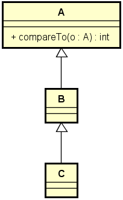

# Generics, Set, Map

## Introdução aos Generics

### Generics
- Generics permitem que classes, interfaces e métodos possam ser
parametrizados por tipo. Seus benefícios são:
- Reuso
- Type safety
- Performance
- Uso comum: coleções
```
List<String> list = new ArrayList<>();
list.add("Maria");
String name = list.get(0);Problema motivador 1 (reuso)
```

> Deseja-se fazer um programa que leia uma quantidade N, e depois N números
inteiros. Ao final, imprima esses números de forma organizada conforme
exemplo. Em seguida, informar qual foi o primeiro valor informado.
```
How many values? 3
10
8
23
[10, 8, 23]
First: 10
```
> Criar um serviço de impressão:Problema motivador 2 (type safety & performance)
Deseja-se fazer um programa que leia uma quantidade N, e depois N nomes de
pessoas. Ao final, imprima esses números de forma organizada conforme
exemplo. Em seguida, informar qual foi o primeiro valor informado.
```
How many values? 3
10
8
23
[10, 8, 23]
First: 10
```
> Criar um serviço de impressão:Solução com generics
Deseja-se fazer um programa que leia uma quantidade N, e depois N números
inteiros. Ao final, imprima esses números de forma organizada conforme
exemplo. Em seguida, informar qual foi o primeiro valor informado.
```
How many values? 3
10
8
23
[10, 8, 23]
First: 10
```

### Criar um serviço de impressão:Genéricos delimitados
- Uma empresa de consultoria deseja avaliar a performance de produtos,
funcionários, dentre outras coisas. Um dos cálculos que ela precisa é encontrar
o maior dentre um conjunto de elementos. Fazer um programa que leia um
conjunto de produtos a partir de um arquivo, conforme exemplo, e depois
mostre o mais caro deles.
- Criar um serviço de cálculo:
```
Computer,890.50
IPhone X,910.00
Tablet,550.00
Most expensive:
IPhone, 910.00
```
- Nota: Java possui:
- Collections.max(list)package services;

```
import java.util.List;
public class CalculationService {
    public static <T extends Comparable<T>> T max(List<T> list) {
        if (list.isEmpty()) {
            throw new IllegalStateException("List can't be empty");
        }

        T max = list.get(0);
        for (T item : list) {
            if (item.compareTo(max) > 0) {
                max = item;
            }
        }
            return max;
    }
}
```
- Versão alternativa (completa)
```
public static <T extends Comparable<? super T>> T max(List<T> list) {
    if (list.isEmpty()) {
        throw new IllegalStateException("List can't be empty");
    }
    T max = list.get(0);
    for (T item : list) {
        if (item.compareTo(max) > 0) {
            max = item;
        }
    }
    return max;
}
```



### Tipos curinga (wildcard types)

### Generics são invariantes
```
List<Object> não é o supertipo de qualquer tipo de lista:
List<Object> myObjs = new ArrayList<Object>();
List<Integer> myNumbers = new ArrayList<Integer>();
myObjs = myNumbers; // erro de compilação
```

- O supertipo de qualquer tipo de lista é List<?>. Este é um tipo curinga:
```
List<?> myObjs = new ArrayList<Object>();
List<Integer> myNumbers = new ArrayList<Integer>();
myObjs = myNumbers;
```
#### Com tipos curinga podemos fazer métodos que recebem um genérico de "qualquer tipo":

```
package application;
import java.util.Arrays;
import java.util.List;
public class Program {
    public static void main(String[] args) {
        List<Integer> myInts = Arrays.asList(5, 2, 10);
            printList(myInts);
        }
        public static void printList(List<?> list) {
        for (Object obj : list) {
            System.out.println(obj);
        }
    }
}
```
- Porém não é possível adicionar dados a uma coleção de tipo curinga
```
package application;
import java.util.ArrayList;
import java.util.List;
public class Program {
    public static void main(String[] args) {
        List<?> list = new ArrayList<Integer>();
        list.add(3); // erro de compilação
    }
}
```
O compilador não sabe qual é o tipo específico do qual a lista foi instanciada.Curingas delimitados (bounded
wildcards)
