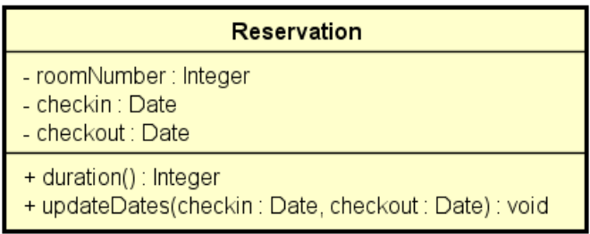
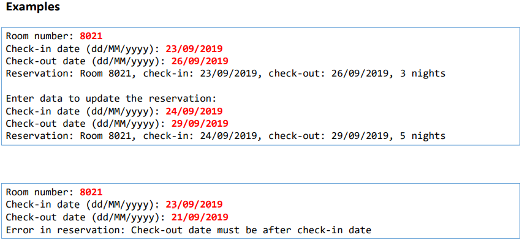
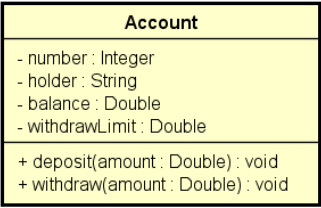

## Tratamento de exceções
##### Exercício de Fixação
- Projeto Tratamento_Excecoes
	- Tratamento
### Exceções
- Uma exceção é qualquer condição de erro ou comportamento inesperado encontrado por um programa em execução
- Em Java, uma exceção é um objeto herdado da classe:
	- java.lang.Exception - o compilador obriga a tratar ou propagar
	- java.lang.RuntimeException - o compilador não obriga a tratar ou propagar
- Quando lançada, uma exceção é propagada na pilha de chamadas de métodos em execução, até que seja capturada (tratada) ou o programa seja encerrado.

#### Hierarquia de exceções do Java

- [Documentação](https://docs.oracle.com/javase/10/docs/api/java/lang/package-tree.html)


#### Por que exceções?
- O modelo de tratamento de exceções permite que erros sejam tratados de forma consistente e flexível, usando boas práticas
- Vantagens:
	- Delega a lógica do erro para a classe responsável por conhecer as regras que podem ocasionar o erro
	- Trata de forma organizada (inclusive hierárquica) exceções de tipos diferentes
	- A exceção pode carregar dados quaisquer.

#### Estrutura try-catch
- Bloco try
	- Contém o código que representa a execução normal do trecho de código que pode acarretar em uma exceção
- Bloco catch
	- Contém o código a ser executado caso uma exceção ocorra
	- Deve ser especificado o tipo da exceção a ser tratada (upcasting é permitido)
```
package application;
import java.util.InputMismatchException;
import java.util.Scanner;
public class Program {
	public static void main(String[] args) {
		Scanner sc = new Scanner(System.in);
		try {
			String[] vect = sc.nextLine().split(" ");
			int position = sc.nextInt();
			System.out.println(vect[position]);
		}
		catch (ArrayIndexOutOfBoundsException e) {
			System.out.println("Invalid position!");
		}
		catch (InputMismatchException e) {
			System.out.println("Input error");
		}

		System.out.println("End of program");
		sc.close();
	}
}
```

#### Bloco finally
- É um bloco que contém código a ser executado independentemente de ter ocorrido ou não uma exceção.
- Exemplo clássico: fechar um arquivo, conexão de banco de dados, ou outro recurso específico ao final do processamento.

```
try {
sc = new Scanner(file);
	while (sc.hasNextLine()) {
		System.out.println(sc.nextLine());
	}
}
catch (IOException e) {
	System.out.println("Error opening file: " + e.getMessage());
}
finally {
	if (sc != null) {
		sc.close();
	}
}
```

#### Criando exceções personalizadas
- Sugestão de pacotes "model"
	- model
		- entities
		- enums
		- exceptions
		- services

#### Problema exemplo
- Fazer um programa para ler os dados de uma reserva de hotel (número do quarto, data de entrada e data de saída) e mostrar os dados da reserva, inclusive sua duração em dias. Em seguida, ler novas datas de entrada e saída, atualizar a reserva, e mostrar novamente a reserva com os dados atualizados. O programa não deve aceitar dados inválidos para a reserva, conforme as seguintes regras:
	- Alterações de reserva só podem ocorrer para datas futuras
	- A data de saída deve ser maior que a data de entrada





#### Resumo da aula
- Cláusula throws: propaga a exceção ao invés de trata-la
- Cláusula throw: lança a exceção / "corta" o método
- Exception: compilador obriga a tratar ou propagar
- RuntimeException: compilador não obriga
- O modelo de tratamento de exceções permite que erros sejam tratados de forma consistente e flexível, usando boas práticas
- Vantagens:
	- Lógica delegada
	- Construtores podem ter tratamento de exceções
	- Possibilidade de auxílio do compilador (Exception)
	- Código mais simples. Não há aninhamento de condicionais: a qualquer momento que uma exceção for disparada, a execução é interrompida e cai no bloco catch correspondente.
	- É possível capturar inclusive outras exceções de sistema
##### Exercício 01
- Projeto Tratamento
	- Exer10-tratamento
#### Exercício de fixação
- Fazer um programa para ler os dados de uma conta bancária e depois realizar um saque nesta conta bancária, mostrando o novo saldo. Um saque não pode ocorrer ou se não houver saldo na conta, ou se o valor do saque for superior ao limite de saque da conta. Implemente a conta bancária conforme projeto abaixo:

