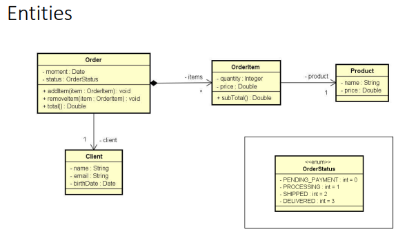
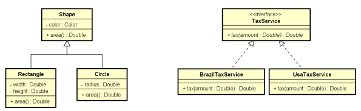
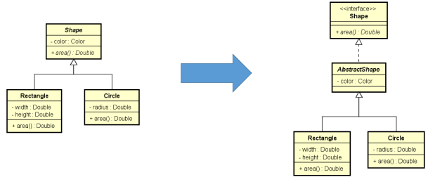

# My Guide

## Basicos

### Locale para pontuação
> Locale.setDefault(Locale.US);
	- colocar sempre antes da deifinição de entrada de dados tipos Scanner ou nas primeiras linhas

### Operações
	- A = Math.sqrt(x);
	- B = Math.pow(x);
	- C = Math.abs(x);
	
### NEXT x NEXTLINE
> sc.next()
	- Ler apenas uma palavra
> sc.nextLine()
	- Ler até a quebra de linha

### Consumir entrada pendente (Limpando Buffer de entrada)
> sc.nextLine()
	- isso acontece quando consome um inteiro antes

### ATALHOS
> Indentação
	- CTRL+SHIFT+F
> Importação de classes
	- CRTL+SHIFT+O
> Organizar o código	
	- CRTL+SHIFT+F

### ERROS
> printf com erro e não compilar
	- projeto -> Properties->Java Compiler. A partir daí, desmarque a caixa "Use compliance… "
	
| Especificador|	Formato			  																									 |
| :----------: | :---------------------------------------------------------------: |
|		%s		     |	String de caracteres											 											 |
|		%d		     |	Número inteiro decimal											 										 |
|		%u		     |	Número inteiro decimal sem sinal								 								 |				 
|		%o		     |	Número inteiro octal sem sinal									 								 |
|		%x, 	     |	%X	Número inteiro hexadecimal sem sinal, minúsculo ou maiúsculo |
|		%f		     |	Float															  														 |
|		%2f		     |	Double														 	  													 |
|		%e, 	     |	%E	Número real, em notação científica, minúsculo ou maiúsculo	 |
|		%b		     |	Boolean														 	 											 			 |
|		%c		     |	Caractere (char)											     											 |

## CAPÍTULO 10 - Memória, Arrays e Listas

- [Memória, Arrays e Listas](./10_Memoria_arrays_listas/README.md)
## CAPÍTULO 11 - Trabalhando com datas

- [Trabalhando com datas](./11_Topicos_especiais_data/README.md)
## CAPÍTULO 12 - Git e Github
- **GIT** : é um sistema de versionamento: você controla as modificações de um projeto por meio de versões chamadas "commits".

| Comando	|  Descrição																  										 |
| :-----: | :--------------------------------------------------------------: |
|CLONE 		| Copia o repositório remoto para seu computador				 					 |
|PULL 		| Atualiza seu repositório local em relação ao repositório remoto  |
|COMMIT 	| Salva uma nova versão (tipicamente no seu repositório local)	   |
|PUSH 		| Envia o repositório local para o repositório remoto			         |

- **GITHUB** - é um serviço de hospedagem de repositórios Git remotos.
	- Possui uma interface gráfica web: github.com
	- É uma plataforma social (usuários, página de perfil, seguidores, colaboração, etc.). Dica: currículo!
	- Maior serviço do mundo de hospedagem de projetos de código aberto
	- Modelo de cobrança: gratuito para projetos de código aberto, pago para projetos privados
	- Alternativas: BitBucket, GitLab, etc.

- Comandos iniciais do git 
	- git config --list
	- git config --global user.name "Teste"
	- git config --global user.email "teste@gmail.com"

| Comando | Detalhes |
| :-----: | :-------:|
| git init    	| Inicia um novo repositório local na pasta do seu projeto|
|git remote add origin https://github.com/username/projeto.git **ATENÇÃO**: troque pelo caminho do seu repositório do Github | Associa seu repositório local ao repositório remoto, com o apelido de "origin"|
|git pull origin master **ATENÇÃO**: este comando só é necessário se você criou o .gitignore pelo Github| Atualiza seu repositório local em relação ao repositório remoto|
|git status Verifica arquivos | git add . Adiciona todos arquivos ao stage|
|git commit -m "Projeto criado"| Salva uma nova versão do projeto|
|git push -u origin master Nota: nas próximas vezes basta fazer: git push | Envia o repositório local para o repositório remoto|

#### Resolução de problemas
| Problema | Comando  |
| :------: | :-------:|
|Quero desfazer tudo que eu fiz desde o último commit |git clean -df  depois git checkout -- .|
|Preciso remover o último commit, porém mantendo os arquivos do jeito que estão. |git reset --soft HEAD~1|
|Preciso remover o último commit, inclusive as alterações nos arquivos.| git reset --hard HEAD~1|
|Quero alterar temporariamente os arquivos do projeto de modo a ficarem no estado do commit informado. **ATENÇÃO**: não podem  haver modificações não commitadas no projeto. NOTA: para voltar ao último commit faça: git checkout master | git checkout <código do commit> EXEMPLO: git checkout e8a52f3 |
|Preciso apagar o último commit no Github | git push -f origin HEAD^:master|
|Quero mudar o meu repositório remoto "origin" | git remote set-url origin https://github.com/username/projeto.git|
|Entrei no VIM por engano. Como sair?| Tecle ESC, depois digite :q! e tecle ENTER|

## CAPÍTULO 13 - ENUMERAÇÕES E COMPOSIÇÕES

### ENUMERAÇÕES
- Projeto
	- Enumeracoes_Composicao
	- Método
		- trabralhandoComEnums()
- Conversão de String para enum
	- OrderStatus os2 = OrderStatus.valueOf("DELIVERED");
##### Notação UML

### COMPOSIÇÕES
> É um tipo de associação que permite que um objeto contenha outro
> Relação "tem-um" ou "tem-vários"
- Vantagens
	- Organização: divisão de responsabilidades
	- Coesão
	- Flexibilidade
	- Reuso
- Nota: embora o símbolo UML para composição (todo-parte) seja o diamante preto, neste contexto estamos chamando de composição qualquer associação tipo "tem-um" e "tem-vários".
##### Exercício Worker
- Projeto Worker
	- Enumeracoes_Composicao


##### Exercício Postagens
- Projeto Post
	- Enumeracoes_Composicao


##### Exercício de Fixação
- Projeto Pedidos
	- Exer06-Composicao


## CAPÍTULO 14 - HERANÇA E POLIMORFISMO

### Herança
- É um tipo de associação que permite que uma classe herde todos dados e comportamentos de outra
	- Definições importantes
	- Vantagens
	- Reuso
	- Polimorfismo
	- Sintaxe
	- class A extends B
- Diagrama herança


	- Relação "é-um"
		- Conta empresarial ela é uma conta só que com algo mais
	- Generalização/especialização
		- Classe Conta é Generalização, quanto que a Conta Empresarial é uma especialização
	- Superclasse (classe base) / subclasse (classe derivada)
	- Herança / extensão
	- Herança é uma associação entre classes (e não entre objetos)
	
#### Upcasting e Downcasting
- Upcasting
	- Casting da subclasse para superclasse
	- Uso comum: polimorfismo
- Downcasting
	- Casting da superclasse para subclasse
	- Palavra instanceof
	- Uso comum: métodos que recebem parâmetros genéricos (ex: Equals)
- Upcasting e Downcasting Exemplo


- Projeto Heranca_Polimorfismo
	- Program
```
Account acc = new Account(1001, "Alex", 0.0);
BusinessAccount bacc = new BusinessAccount(1002, "Maria", 0.0, 500.0);

// UPCASTING
Account acc1 = bacc;
Account acc2 = new BusinessAccount(1003, "Bob", 0.0, 200.0);
Account acc3 = new SavingsAccount(1004, "Anna", 0.0, 0.01);

// DOWNCASTING
BusinessAccount acc4 = (BusinessAccount)acc2;
acc4.loan(100.0);

// BusinessAccount acc5 = (BusinessAccount)acc3;
// Verifica se acc3 é instância de BusinessAccount
if (acc3 instanceof BusinessAccount) {
	BusinessAccount acc5 = (BusinessAccount)acc3;
	acc5.loan(200.0);
	System.out.println("Loan!");
}

if (acc3 instanceof SavingsAccount) {
	SavingsAccount acc5 = (SavingsAccount)acc3;
	acc5.updateBalance();
	System.out.println("Update!");
}
```
### Sobreposição, palavra super, anotação @Override
- Sobreposição ou sobrescrita
	- É a implementação de um método de uma superclasse na subclasse
	- É fortemente recomendável usar a anotação @Override em um método sobrescrito
		- Facilita a leitura e compreensão do código
		- Avisamos ao compilador (boa prática)

		

- Suponha que a operação de saque possui uma taxa no valor de 5.0. Entretanto, se a conta for do tipo poupança, esta taxa não deve ser cobrada.
- Como resolver isso?
- Resposta: sobrescrevendo o método withdraw na subclasse SavingsAccount
- **Account:**
```
public void withdraw(double amount) {
	balance -= amount + 5.0;
}
```
- **SavingsAccount:**
```
@Override
public void withdraw(double amount) {
	balance -= amount;
}
```
##### Palavra super
- É possível chamar a implementação da superclasse usando a palavra super. 
- Exemplo: suponha que, na classe BusinessAccount, a regra para saque seja realizar o saque normalmente da superclasse, e descontar mais 2.0.
```
@Override
public void withdraw(double amount) {
	super.withdraw(amount);
	balance -= 2.0;
}
```
##### Classes e métodos final
- Palavra chave: final
- Classe: evita que a classe seja herdada
```public final class SavingsAccount {```
- Método: evita que o método sob seja sobreposto
```
@Override
	public final void withdraw(double amount) {
	balance -= amount;
}
```
##### Pra quê?
- Segurança: dependendo das regras do negócio, às vezes é desejável garantir que uma classe não seja herdada, ou que um método não seja sobreposto.
	- Geralmente convém acrescentar final em métodos sobrepostos, pois sobreposições múltiplas podem ser uma porta de entrada para
inconsistências
- Performance: atributos de tipo de uma classe final são analisados de forma mais rápida em tempo de execução.
	- Exemplo clássico: String
	
### Polimorfismo

##### Pilares da OOP
- Encapsulamento
- Herança
- Polimorfismo
	- Em Programação Orientada a Objetos, polimorfismo é recurso que permite que variáveis de um mesmo tipo mais genérico possam apontar para objetos de tipos específicos diferentes, tendo assim comportamentos diferentes conforme cada tipo específico.
```
Account x = new Account(1020, "Alex", 1000.0);
Account y = new SavingsAccount(1023, "Maria", 1000.0, 0.01);

x.withdraw(50.0);
y.withdraw(50.0);
```
	
- A associação do tipo específico com o tipo genérico é feita em tempo de execução (upcasting).
- O compilador não sabe para qual tipo específico a chamada do método Withdraw está sendo feita (ele só sabe que são duas variáveis tipo Account):

##### Exercício 01
- Projeto Employee
	- Exer07-polimorfismo


##### Resumo
- Uma empresa possui funcionários próprios e terceirizados. Para cada funcionário, deseja-se registrar nome, horas trabalhadas e valor por hora. Funcionários terceirizado possuem ainda uma despesa adicional.
- O pagamento dos funcionários corresponde ao valor da hora multiplicado pelas horas trabalhadas, sendo que os funcionários terceirizados ainda recebem um bônus correspondente a 110% de sua despesa adicional.
- Fazer um programa para ler os dados de N funcionários (N fornecido pelo usuário) e armazená-los em uma lista. Depois de ler todos os dados, mostrar nome e pagamento de cada funcionário na mesma ordem em que foram digitados.
- Construa o programa conforme projeto ao lado. Veja exemplo na próxima página.


##### Exercício de Fixação
- Projeto Products
	- Exer08-polimorfismo
##### Resumo
- Fazer um programa para ler os dados de N produtos (N fornecido pelo usuário). Ao final, mostrar a etiqueta de preço de cada produto na mesma ordem em que foram digitados.
- Todo produto possui nome e preço. Produtos importados possuem uma taxa de alfândega, e produtos usados possuem data de fabricação. Estes dados específicos devem ser acrescentados na etiqueta de preço conforme exemplo (próxima página). Para produtos importados, a taxa e alfândega deve ser acrescentada ao preço final do produto.


### Classes abstratas
- São classes que não podem ser instanciadas
- É uma forma de garantir herança total: somente subclasses não abstratas podem ser instanciadas, mas nunca a superclasse abstrata
- Suponha que em um negócio relacionado a banco, apenas contas poupança e contas para empresas são permitidas. Não existe conta comum.
Para garantir que contas comuns não possam ser instanciadas, basta acrescentarmos a palavra "abstract" na declaração da classe.
```
public abstract class Account {
(...)
```


Questionamento
- Se a classe Account não pode ser instanciada, por que simplesmente não criar somente SavingsAccount e BusinessAccount?
- Resposta:
	- Reuso
	- Polimorfismo: a superclasse classe genérica nos permite tratar de forma fácil e uniforme todos os tipos de conta, inclusive com polimorfismo se for o caso (como fizemos nos últimos exercícios). Por exemplo, você pode colocar todos tipos de contas em uma mesma coleção.
- Demo: suponha que você queira:
	- Totalizar o saldo de todas as contas.
	- Depositar 10.00 em todas as contas
##### Exercício de Fixação
- Projeto Products
	- Heranca_Polimorfismo
	
### Métodos abstratos
- São métodos que não possuem implementação.
- Métodos precisam ser abstratos quando a classe é genérica demais para conter sua implementação.
- Se uma classe possuir pelo menos um método abstrato, então esta classe também é abstrata.
- Notação UML: itálico


##### Exercício de Resolvido
- Projeto Products
	- Heranca_Polimorfismo
	
##### Resumo
- Fazer um programa para ler os dados de N contribuintes (N fornecido pelo usuário), os quais podem ser pessoa física ou pessoa jurídica, e depois mostrar o valor do imposto pago por cada um, bem como o total de imposto arrecadado.
- Os dados de pessoa física são: nome, renda anual e gastos com saúde. Os dados de pessoa jurídica são nome, renda anual e número de funcionários. As regras para cálculo de imposto são as seguintes:
- Pessoa física: pessoas cuja renda foi abaixo de 20000.00 pagam 15% de imposto. Pessoas com renda de 20000.00 em diante pagam 25% de imposto. Se a pessoa teve gastos com saúde, 50% destes gastos são abatidos no imposto. Exemplo: uma pessoa cuja renda foi 50000.00 e teve 2000.00 em gastos com saúde, o imposto
fica: (50000 * 25%) - (2000 * 50%) = 11500.00
- Pessoa jurídica: pessoas jurídicas pagam 16% de imposto. Porém, se a empresa possuir mais de 10 funcionários, ela paga 14% de imposto. Exemplo: uma empresa cuja renda foi 400000.00 e possui 25 funcionários, o imposto fica: 400000 * 14% = 56000.00


## CAPÍTULO 15 - TRATAMENTO DE EXCEÇÕES
- [Tratamento de Execeções](./Exer10-tratamento/tratamento.md)

## CAPÍTULO 16 - LENDO ARQUIVO TEXTO COM CLASSE FILE E SCANNER

- [Trabalhando com arquivos](./Trabalhando_com_arquivos/Files.md)
## CAPÍTULO 17 - TRABALHANDO COM ARQUIVOS

- [Trabalhando com arquivos](./17_Trabalhando_com_arquivos/README.MD)

## CAPÍTULO 18 - INTERFACES
- A partir do Java 8, interfaces podem ter "default methods" ou "defender methods"
- Isso possui implicações conceituais e práticas, que serão discutidas mais à frente neste capítulo
- Primeiro vamos trabalhar com a definição "clássica" de interfaces. Depois vamos acrescentar o conceito de default methods

- Interface é um tipo que define um conjunto de operações que uma classe deve implementar.
- A interface estabelece um **contrato** que a classe deve cumprir.
```
interface Shape {
	double area();
	double perimeter();
}
```
- Pra quê interfaces?
	- Para criar sistemas com baixo acoplamento e flexíveis.

#### Problema exemplo
- Uma locadora brasileira de carros cobra um valor por hora para locações de até 12 horas. Porém, se a duração da locação ultrapassar 12 horas, a locação será cobrada com base em um valor diário. Além do valor da locação, é acrescido no preço o valor do imposto conforme regras do país que, no caso do Brasil, é 20% para valores até 100.00, ou 15% para valores acima de 100.00. Fazer um programa que lê os dados da locação (modelo do carro, instante inicial e final da locação), bem como o valor por hora e o valor diário de locação. O programa deve então gerar a nota de pagamento (contendo valor da locação, valor do imposto e valor total do pagamento) e informar os dados na tela. Veja os exemplos.

#### Example 1:


```
Calculations:
Duration = (25/06/2018 14:40) - (25/06/2018 10:30) = 4:10 = 5 hours
Basic payment = 5 * 10 = 50
Tax = 50 * 20% = 50 * 0.2 = 10
```





## Inversão de controle, Injeção de dependência
- Acoplamento forte
- A classe RentalService conhece a dependência concreta
- Se a classe concreta mudar, é preciso mudar a classe RentalService
##### Service layer design (**no interface**)

```
class RentalService {
	(...)
	private BrazilTaxService taxService;
```

##### Service layer design
- Acoplamento fraco
- A classe RentalService não conhece a dependência concreta
- Se a classe concreta mudar, a classe RentalService não muda nada

```
class RentalService {
	(...)
	private BrazilTaxService taxService;
```


#### Inversão de controle
- Inversão de controle
	- Padrão de desenvolvimento que consiste em retirar da classe aresponsabilidade de instanciar suas dependências.
- Injeção de dependência
	- É uma forma de realizar a inversão de controle: um componente externo instancia a dependência, que é então injetada no objeto "pai". Pode ser implementada de várias formas:
		- Construtor
		- Classe de instanciação (builder / factory)
		- Container / framework


##### Exercício de fixação
- Uma empresa deseja automatizar o processamento de seus contratos. O processamento de um contrato consiste em gerar as parcelas a serem pagas para aquele contrato, com base no número de meses desejado.
- A empresa utiliza um serviço de pagamento online para realizar o pagamento das parcelas. Os serviços de pagamento online tipicamente cobram um juro mensal, bem como uma taxa por pagamento. Por enquanto, o serviço contratado pela empresa é o do Paypal, que aplica juros simples de 1% a cada parcela, mais uma taxa de pagamento de 2%.
- Fazer um programa para ler os dados de um contrato (número do contrato, data do contrato, e valor total do contrato). Em seguida, o programa deve ler o número de meses para parcelamento do contrato, e daí gerar os registros de parcelas a serem pagas (data e valor), sendo a primeira parcela a ser paga um mês após a data do contrato, a  segunda parcela dois meses após o contrato e assim por diante. Mostrar os dados das parcelas na tela.

### Domain layer design (entities)


### Service layer design


## Herdar vs. cumprir contrato
- Aspectos em comum entre herança e interfaces
	- Relação é-um
	- Generalização/especialização
	- Polimorfismo



- Diferença fundamental
	- Herança => reuso
	- Interface => contrato a ser cumprido
- E se eu precisar implementar Shape como interface, porém também quiser definir uma estrutura comum reutilizável para todas figuras?



- Outro exemplo


### Herança múltipla e o problema do diamante
- A herança múltipla pode gerar o problema do diamante: uma ambiguidade causada pela existência do mesmo método em mais de uma superclasse. Herança múltipla não é permitida na maioria das linguagens!


- Porém, uma classe pode implementar mais de uma interface
- **ATENÇÃO:**
	- Isso NÃO é herança múltipla, pois NÃO HÁ REUSO na relação entre ComboDevice e as interfaces Scanner e Printer. ComboDevide não herda, mas sim implementa as interfaces (cumpre o contrato).

### Interface Comparable
```
public interface Comparable<T> {
	int compareTo (T o);
}
```

##### Problema motivador
 - Faça um programa para ler um arquivo contendo nomes de pessoas (um nome por linha), armazenando-os em uma lista. Depois, ordenar os dados dessa lista e mostra-los ordenadamente na tela. Nota: o caminho do arquivo pode ser informado "hardcode".

	- Maria Brown
	- Alex Green
	- Bob Grey
	- Anna White
	- Alex Black
	- Eduardo Rose
	- Willian Red
	- Marta Blue
	- Alex Brown

```
package application;
import java.io.BufferedReader;
import java.io.FileReader;
import java.io.IOException;
import java.util.ArrayList;
import java.util.Collections;
import java.util.List;
public class Program {
	public static void main(String[] args) {

		List<String> list = new ArrayList<>();
		String path = "C:\\temp\\in.txt";

		try (BufferedReader br = new BufferedReader(new FileReader(path))) {

			String name = br.readLine();
			while (name != null) {
			list.add(name);
			name = br.readLine();
		}

		Collections.sort(list);
		for (String s : list) {
			System.out.println(s);
		}

		} catch (IOException e) {
			System.out.println("Error: " + e.getMessage());
		}
	}
}
```

##### Outro problema

- Faça um programa para ler um arquivo contendo funcionários (nome e salário) no formato .csv, armazenando-os em uma lista. Depois, ordenar a lista por nome e mostrar o resultado na tela. Nota: o caminho do arquivo pode ser informado "hardcode".

	- Maria Brown,4300.00
	- Alex Green,3100.00
	- Bob Grey,3100.00
	- Anna White,3500.00
	- Alex Black,2450.00
	- Eduardo Rose,4390.00
	- Willian Red,2900.00
	- Marta Blue,6100.00
	- Alex Brown,5000.00

## Interface Comparable


- **Method compareTo:**
- **Parameters:**
	- o - the object to be compared.
- **Returns:**
	- a negative integer, zero, or a positive integer as this object is less than, equal to, or greater than the specified object.

```
package application;
import java.io.BufferedReader;
import java.io.FileReader;
import java.io.IOException;
import java.util.ArrayList;
import java.util.Collections;
import java.util.List;
import entities.Employee;
public class Program {
	public static void main(String[] args) {
	List<Employee> list = new ArrayList<>();

	String path = "C:\\temp\\in.txt";
	try (BufferedReader br = new BufferedReader(new FileReader(path))) {
		String employeeCsv = br.readLine();
		while (employeeCsv != null) {
		String[] fields = employeeCsv.split(",");
		list.add(new Employee(fields[0], Double.parseDouble(fields[1])));
		employeeCsv = br.readLine();

		}
		Collections.sort(list);
		for (Employee emp : list) {
			System.out.println(emp.getName() + ", " + emp.getSalary());
		}

		} catch (IOException e) {
			System.out.println("Error: " + e.getMessage());
		}
	}
}
```

```
package entities;
public class Employee implements Comparable<Employee> {
	private String name;
	private Double salary;

	public Employee(String name, Double salary) {
		this.name = name;
		this.salary = salary;
	}
	public String getName() {
		return name;
	}

	public void setName(String name) {
		this.name = name;
	}

	public Double getSalary() {
		return salary;
	}

	public void setSalary(Double salary) {
		this.salary = salary;
	}
	
	@Override
	public int compareTo(Employee other) {
		return name.compareTo(other.getName());
	}
}
```

### Default methods (defender methods)
- A partir do Java 8, interfaces podem conter métodos concretos.
- A intenção básica é prover implementação padrão para métodos, de modo a evitar:
	- 1) repetição de implementação em toda classe que implemente a interface
	- 2) a necessidade de se criar classes abstratas para prover reuso da implementação
- Outras vantagens:
	- Manter a retrocompatibilidade com sistemas existentes
	- Permitir que "interfaces funcionais" (que devem conter apenas um método) possam prover outras operações padrão reutilizáveis

#### Problema exemplo
- Fazer um programa para ler uma quantia e a duração em meses de um empréstimo. Informar o valor a ser pago depois de decorrido o prazo do empréstimo, conforme regras de juros do Brasil. A regra de cálculo de juros do Brasil é juro composto padrão de 2% ao mês.


```
Calculations: Payment = 200 * 1.02 * 1.02 * 1.02 = 200 * 1.023 = 212.2416
Payment = amount * (1 + interestRate / 100)N
```


- What if there was another interest service from another country?


```
Calculations: Payment = 200 * 1.01 * 1.01 * 1.01 = 200 * 1.013 = 206.0602
Payment = amount * (1 + interestRate / 100)N
```


### Considerações importantes
	- Sim: agora as interfaces podem prover reuso
	- Sim: agora temos uma forma de herança múltipla
	- Mas o compilador reclama se houver mais de um método com a mesma assinatura, obrigando a sobrescreve-lo
	- Interfaces ainda são bem diferentes de classes abstratas. Interfaces não possuem recursos tais como construtores e atributos.

	

- [Interfaces](./Trabalhando_com_arquivos/Interfaces.md)