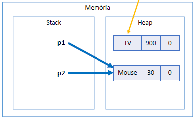
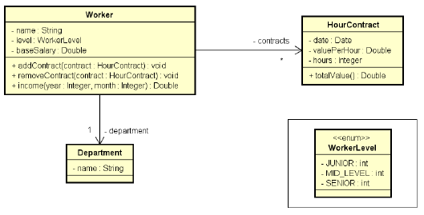

# My Guide

## Basicos

### Locale para pontuação
> Locale.setDefault(Locale.US);
	- colocar sempre antes da deifinição de entrada de dados tipos Scanner ou nas primeiras linhas

### Operações
	- A = Math.sqrt(x);
	- B = Math.pow(x);
	- C = Math.abs(x);
	
### NEXT x NEXTLINE
> sc.next()
	- Ler apenas uma palavra
> sc.nextLine()
	- Ler até a quebra de linha

### Consumir entrada pendente (Limpando Buffer de entrada)
> sc.nextLine()
	- isso acontece quando consome um inteiro antes

### ATALHOS
> Indentação
	- CTRL+SHIFT+F
> Importação de classes
	- CRTL+SHIFT+O
> Organizar o código	
	- CRTL+SHIFT+F

### ERROS
> printf com erro e não compilar
	- projeto -> Properties->Java Compiler. A partir daí, desmarque a caixa "Use compliance… "
	
| Especificador|	Formato			  																									 |
| :----------: | :---------------------------------------------------------------: |
|		%s		     |	String de caracteres											 											 |
|		%d		     |	Número inteiro decimal											 										 |
|		%u		     |	Número inteiro decimal sem sinal								 								 |				 
|		%o		     |	Número inteiro octal sem sinal									 								 |
|		%x, 	     |	%X	Número inteiro hexadecimal sem sinal, minúsculo ou maiúsculo |
|		%f		     |	Float															  														 |
|		%2f		     |	Double														 	  													 |
|		%e, 	     |	%E	Número real, em notação científica, minúsculo ou maiúsculo	 |
|		%b		     |	Boolean														 	 											 			 |
|		%c		     |	Caractere (char)											     											 |

## CAPÍTULO 10 - Memória, Arrays e Listas

### Mémoria
- Projeto
	- Mod02
	- Método
- Tipos referência vs. tipos valor
```
Product p1, p2;
p1 = new Product("TV", 900.00, 0);
p2 = p1;
```

- Tipos primitivos são tipos valor
	- Tipos primitivos ficam na Stack
```
double x, y;
x = 10;
y = x;
```

- Quando alocamos (new) qualquer tipo estruturado (classe ou array), são atribuídos valores padrão os seus elementos
	- números: 0
	- boolean: false
	- char: caractere código 0
	- objeto: null
		- p -> name=null, price=0.0, quantity=0
#### Tipos referência vs. tipos valor

|CLASSE |TIPO PRIMITIVO|
| :---: | :----------: |
|Vantagem: usufrui de todos recursos OO |Vantagem: é mais simples e mais performático|
|Variáveis são ponteiros |Variáveis são caixas|
|Objetos precisam ser instanciados usando new, ou apontar para um objeto já existente.| Não instancia. Uma vez declarados, estão prontos para uso.|
|Aceita valor null |Não aceita valor null|
|Y = X; "Y passa a apontar para onde X aponta"| Y = X; "Y recebe uma cópia de X"|
|Objetos instanciados no heap |"Objetos" instanciados no stack|
|Objetos não utilizados são desalocados em um momento próximo pelo garbage collector |"Objetos" são desalocados imediatamente quando seu escopo de execução é finalizado|

#### Garbage collector
- É um processo que automatiza o gerenciamento de memória de um programa em execução
- O garbage collector monitora os objetos alocados dinamicamente pelo programa (no heap), desalocando aqueles que não estão mais sendo utilizados.
- Desalocação por garbage collector
```
Product p1, p2;
p1 = new Product("TV", 900.00, 0);
p2 = new Product("Mouse", 30.00, 0);

p1 = p2;
```


- Desalocação por escopo
	 - A variável só vai existir enquanto estiver no seu escopo
#### Resumo
- Objetos alocados dinamicamente, quando não possuem mais referência para eles, serão desalocados pe
lo garbage collector 
- Variáveis locais são desalocadas imediatamente assim que seu escopo local sai de execução

### Vetores
- Em programação, "vetor" é o nome dado a arranjos unidimensionais
- Arranjo (array) é uma estrutura de dados:
	- Homogênea (dados do mesmo tipo)
	- Ordenada (elementos acessados por meio de posições)
	- Alocada de uma vez só, em um bloco contíguo de memória
- Vantagens:
	- Acesso imediato aos elementos pela sua posição
- Desvantagens:
	- Tamanho fixo
	- Dificuldade para se realizar inserções e deleções

...

## CAPÍTULO 11 - Trabalhando com datas
- Projeto
	- Mod02
	- Método
		- datas()
- Um objeto Date internamente armazena:
	- O número de milissegundos desde a meia noite do dia 1 de janeiro de 1970 GMT (UTC)
	- GMT: Greenwich Mean Time (time zone)
	- UTC: Coordinated Universal Time (time standard)
- **SimpleDateFormat**
	- [Documentação](https://docs.oracle.com/javase/10/docs/api/java/text/SimpleDateFormat.html)
		- Define formatos para conversão entre Date e String
		- dd/MM/yyyy -> 23/07/2018
		- dd/MM/yyyy HH:mm:ss -> 23/07/2018 15:42:07
- **Padrão ISO 8601 e classe Instant**
	- Formato: yyyy-MM-ddTHH:mm:ssZ
	- Exemplo: "2018-06-25T15:42:07Z"
	- Date y3 = Date.from(Instant.parse("2018-06-25T15:42:07Z"));
#### Manipulando uma data com Calendar
- Somando uma unidade de tempo
	- Método: usandoCalendar()

```
public static void usandoCalendar(){
		SimpleDateFormat sdf = new SimpleDateFormat("dd/MM/yyyy HH:mm:ss");
		Date d = Date.from(Instant.parse("2018-06-25T15:42:07Z"));
		Calendar cal = Calendar.getInstance();
	
		cal.setTime(d);
		cal.add(Calendar.HOUR_OF_DAY, 4);
		d = cal.getTime();
		int minutes = cal.get(Calendar.MINUTE);
		int month = 1 + cal.get(Calendar.MONTH);
		
		System.out.println(sdf.format(d));							// 25/06/2018 12:42:07
		System.out.println("Minutes: "+minutes);				// Minutes: 42
		System.out.println("Month: "+month);						// Month: 6
	}
```

<!--  -->

## CAPÍTULO 12 - Git e Github
- **GIT** : é um sistema de versionamento: você controla as modificações de um projeto por meio de versões chamadas "commits".

| Comando	|  Descrição																  										 |
| :-----: | :--------------------------------------------------------------: |
|CLONE 		| Copia o repositório remoto para seu computador				 					 |
|PULL 		| Atualiza seu repositório local em relação ao repositório remoto  |
|COMMIT 	| Salva uma nova versão (tipicamente no seu repositório local)	   |
|PUSH 		| Envia o repositório local para o repositório remoto			         |

- **GITHUB** - é um serviço de hospedagem de repositórios Git remotos.
	- Possui uma interface gráfica web: github.com
	- É uma plataforma social (usuários, página de perfil, seguidores, colaboração, etc.). Dica: currículo!
	- Maior serviço do mundo de hospedagem de projetos de código aberto
	- Modelo de cobrança: gratuito para projetos de código aberto, pago para projetos privados
	- Alternativas: BitBucket, GitLab, etc.

- Comandos iniciais do git 
	- git config --list
	- git config --global user.name "Teste"
	- git config --global user.email "teste@gmail.com"

| Comando | Detalhes |
| :-----: | :-------:|
| git init    	| Inicia um novo repositório local na pasta do seu projeto|
|git remote add origin https://github.com/username/projeto.git **ATENÇÃO**: troque pelo caminho do seu repositório do Github | Associa seu repositório local ao repositório remoto, com o apelido de "origin"|
|git pull origin master **ATENÇÃO**: este comando só é necessário se você criou o .gitignore pelo Github| Atualiza seu repositório local em relação ao repositório remoto|
|git status Verifica arquivos | git add . Adiciona todos arquivos ao stage|
|git commit -m "Projeto criado"| Salva uma nova versão do projeto|
|git push -u origin master Nota: nas próximas vezes basta fazer: git push | Envia o repositório local para o repositório remoto|

#### Resolução de problemas
| Problema | Comando  |
| :------: | :-------:|
|Quero desfazer tudo que eu fiz desde o último commit |git clean -df  depois git checkout -- .|
|Preciso remover o último commit, porém mantendo os arquivos do jeito que estão. |git reset --soft HEAD~1|
|Preciso remover o último commit, inclusive as alterações nos arquivos.| git reset --hard HEAD~1|
|Quero alterar temporariamente os arquivos do projeto de modo a ficarem no estado do commit informado. **ATENÇÃO**: não podem  haver modificações não commitadas no projeto. NOTA: para voltar ao último commit faça: git checkout master | git checkout <código do commit> EXEMPLO: git checkout e8a52f3 |
|Preciso apagar o último commit no Github | git push -f origin HEAD^:master|
|Quero mudar o meu repositório remoto "origin" | git remote set-url origin https://github.com/username/projeto.git|
|Entrei no VIM por engano. Como sair?| Tecle ESC, depois digite :q! e tecle ENTER|

## CAPÍTULO 13 - ENUMERAÇÕES E COMPOSIÇÕES

### ENUMERAÇÕES
- Projeto
	- Enumeracoes_Composicao
	- Método
		- trabralhandoComEnums()
- Conversão de String para enum
	- OrderStatus os2 = OrderStatus.valueOf("DELIVERED");
##### Notação UML

### COMPOSIÇÕES
> É um tipo de associação que permite que um objeto contenha outro
> Relação "tem-um" ou "tem-vários"
- Vantagens
	- Organização: divisão de responsabilidades
	- Coesão
	- Flexibilidade
	- Reuso
- Nota: embora o símbolo UML para composição (todo-parte) seja o diamante preto, neste contexto estamos chamando de composição qualquer associação tipo "tem-um" e "tem-vários".
##### Exercício Worker
- Projeto Worker
	- Enumeracoes_Composicao


##### Exercício Postagens
- Projeto Post
	- Enumeracoes_Composicao


##### Exercício de Fixação
- Projeto Pedidos
	- Exer06-Composicao


## CAPÍTULO 13 - HERANÇA E POLIMORFISMO

### Herança
- É um tipo de associação que permite que uma classe herde todos dados e comportamentos de outra
	- Definições importantes
	- Vantagens
	- Reuso
	- Polimorfismo
	- Sintaxe
	- class A extends B
- Diagrama herança


	- Relação "é-um"
		- Conta empresarial ela é uma conta só que com algo mais
	- Generalização/especialização
		- Classe Conta é Generalização, quanto que a Conta Empresarial é uma especialização
	- Superclasse (classe base) / subclasse (classe derivada)
	- Herança / extensão
	- Herança é uma associação entre classes (e não entre objetos)
	
#### Upcasting e Downcasting
- Upcasting
	- Casting da subclasse para superclasse
	- Uso comum: polimorfismo
- Downcasting
	- Casting da superclasse para subclasse
	- Palavra instanceof
	- Uso comum: métodos que recebem parâmetros genéricos (ex: Equals)
- Upcasting e Downcasting Exemplo

### Polimorfismo


