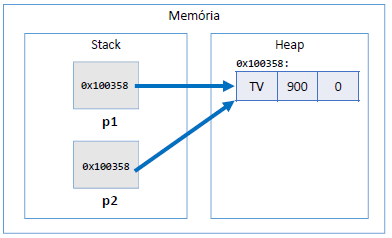

# My Guide

## Basicos

### Locale para pontuação
> Locale.setDefault(Locale.US);
	- colocar sempre antes da deifinição de entrada de dados tipos Scanner ou nas primeiras linhas

### Operações
	- A = Math.sqrt(x);
	- B = Math.pow(x);
	- C = Math.abs(x);
	
### NEXT x NEXTLINE
> sc.next()
	- Ler apenas uma palavra
> sc.nextLine()
	- Ler até a quebra de linha

### Consumir entrada pendente (Limpando Buffer de entrada)
> sc.nextLine()
	- isso acontece quando consome um inteiro antes

### ATALHOS
> Indentação
	- CTRL+SHIFT+F
> Importação de classes
	- CRTL+SHIFT+O
> Organizar o código	
	- CRTL+SHIFT+F

### ERROS
> printf com erro e não compilar
	- projeto -> Properties->Java Compiler. A partir daí, desmarque a caixa "Use compliance… "
	
| Especificador|	Formato			  																									 |
| :----------: | :---------------------------------------------------------------: |
|		%s		     |	String de caracteres											 											 |
|		%d		     |	Número inteiro decimal											 										 |
|		%u		     |	Número inteiro decimal sem sinal								 								 |				 
|		%o		     |	Número inteiro octal sem sinal									 								 |
|		%x, 	     |	%X	Número inteiro hexadecimal sem sinal, minúsculo ou maiúsculo |
|		%f		     |	Float															  														 |
|		%2f		     |	Double														 	  													 |
|		%e, 	     |	%E	Número real, em notação científica, minúsculo ou maiúsculo	 |
|		%b		     |	Boolean														 	 											 			 |
|		%c		     |	Caractere (char)											     											 |

## CAPÍTULO 10 - Memória, Arrays e Listas

### Mémoria
- Projeto
	- Mod02
	- Método
- Tipos referência vs. tipos valor
```
Product p1, p2;
p1 = new Product("TV", 900.00, 0);
p2 = p1;
```

- Tipos primitivos são tipos valor
	- Tipos primitivos ficam na Stack
```
double x, y;
x = 10;
y = x;
```

- Quando alocamos (new) qualquer tipo estruturado (classe ou array), são atribuídos valores padrão os seus elementos
	- números: 0
	- boolean: false
	- char: caractere código 0
	- objeto: null
		- p -> name=null, price=0.0, quantity=0
#### Tipos referência vs. tipos valor

|CLASSE |TIPO PRIMITIVO|
| :---: | :----------: |
|Vantagem: usufrui de todos recursos OO |Vantagem: é mais simples e mais performático|
|Variáveis são ponteiros |Variáveis são caixas|
|Objetos precisam ser instanciados usando new, ou apontar para um objeto já existente.| Não instancia. Uma vez declarados, estão prontos para uso.|
|Aceita valor null |Não aceita valor null|
|Y = X; "Y passa a apontar para onde X aponta"| Y = X; "Y recebe uma cópia de X"|
|Objetos instanciados no heap |"Objetos" instanciados no stack|
|Objetos não utilizados são desalocados em um momento próximo pelo garbage collector |"Objetos" são desalocados imediatamente quando seu escopo de execução é finalizado|

#### Garbage collector
- É um processo que automatiza o gerenciamento de memória de um programa em execução
- O garbage collector monitora os objetos alocados dinamicamente pelo programa (no heap), desalocando aqueles que não estão mais sendo utilizados.
- Desalocação por garbage collector
```
Product p1, p2;
p1 = new Product("TV", 900.00, 0);
p2 = new Product("Mouse", 30.00, 0);

p1 = p2;
```


- Desalocação por escopo
	 - A variável só vai existir enquanto estiver no seu escopo
#### Resumo
- Objetos alocados dinamicamente, quando não possuem mais referência para eles, serão desalocados pe
lo garbage collector 
- Variáveis locais são desalocadas imediatamente assim que seu escopo local sai de execução

### Vetores
- Em programação, "vetor" é o nome dado a arranjos unidimensionais
- Arranjo (array) é uma estrutura de dados:
	- Homogênea (dados do mesmo tipo)
	- Ordenada (elementos acessados por meio de posições)
	- Alocada de uma vez só, em um bloco contíguo de memória
- Vantagens:
	- Acesso imediato aos elementos pela sua posição
- Desvantagens:
	- Tamanho fixo
	- Dificuldade para se realizar inserções e deleções

## CAPÍTULO 11 - Trabalhando com datas
- Projeto
	- Mod02
	- Método
		- datas()
- Um objeto Date internamente armazena:
	- O número de milissegundos desde a meia noite do dia 1 de janeiro de 1970 GMT (UTC)
	- GMT: Greenwich Mean Time (time zone)
	- UTC: Coordinated Universal Time (time standard)
- **SimpleDateFormat**
	- [Documentação](https://docs.oracle.com/javase/10/docs/api/java/text/SimpleDateFormat.html)
		- Define formatos para conversão entre Date e String
		- dd/MM/yyyy -> 23/07/2018
		- dd/MM/yyyy HH:mm:ss -> 23/07/2018 15:42:07
- **Padrão ISO 8601 e classe Instant**
	- Formato: yyyy-MM-ddTHH:mm:ssZ
	- Exemplo: "2018-06-25T15:42:07Z"
	- Date y3 = Date.from(Instant.parse("2018-06-25T15:42:07Z"));
#### Manipulando uma data com Calendar
- Somando uma unidade de tempo
	- Método: usandoCalendar()

```
public static void usandoCalendar(){
		SimpleDateFormat sdf = new SimpleDateFormat("dd/MM/yyyy HH:mm:ss");
		Date d = Date.from(Instant.parse("2018-06-25T15:42:07Z"));
		Calendar cal = Calendar.getInstance();
	
		cal.setTime(d);
		cal.add(Calendar.HOUR_OF_DAY, 4);
		d = cal.getTime();
		int minutes = cal.get(Calendar.MINUTE);
		int month = 1 + cal.get(Calendar.MONTH);
		
		System.out.println(sdf.format(d));							// 25/06/2018 12:42:07
		System.out.println("Minutes: "+minutes);				// Minutes: 42
		System.out.println("Month: "+month);						// Month: 6
	}
```

<!--  -->

## CAPÍTULO 12 - Git e Github
- **GIT** : é um sistema de versionamento: você controla as modificações de um projeto por meio de versões chamadas "commits".

| Comando	|  Descrição																  										 |
| :-----: | :--------------------------------------------------------------: |
|CLONE 		| Copia o repositório remoto para seu computador				 					 |
|PULL 		| Atualiza seu repositório local em relação ao repositório remoto  |
|COMMIT 	| Salva uma nova versão (tipicamente no seu repositório local)	   |
|PUSH 		| Envia o repositório local para o repositório remoto			         |

- **GITHUB** - é um serviço de hospedagem de repositórios Git remotos.
	- Possui uma interface gráfica web: github.com
	- É uma plataforma social (usuários, página de perfil, seguidores, colaboração, etc.). Dica: currículo!
	- Maior serviço do mundo de hospedagem de projetos de código aberto
	- Modelo de cobrança: gratuito para projetos de código aberto, pago para projetos privados
	- Alternativas: BitBucket, GitLab, etc.

- Comandos iniciais do git 
	- git config --list
	- git config --global user.name "Teste"
	- git config --global user.email "teste@gmail.com"

| Comando | Detalhes |
| :-----: | :-------:|
| git init    	| Inicia um novo repositório local na pasta do seu projeto|
|git remote add origin https://github.com/username/projeto.git **ATENÇÃO**: troque pelo caminho do seu repositório do Github | Associa seu repositório local ao repositório remoto, com o apelido de "origin"|
|git pull origin master **ATENÇÃO**: este comando só é necessário se você criou o .gitignore pelo Github| Atualiza seu repositório local em relação ao repositório remoto|
|git status Verifica arquivos | git add . Adiciona todos arquivos ao stage|
|git commit -m "Projeto criado"| Salva uma nova versão do projeto|
|git push -u origin master Nota: nas próximas vezes basta fazer: git push | Envia o repositório local para o repositório remoto|

#### Resolução de problemas
| Problema | Comando  |
| :------: | :-------:|
|Quero desfazer tudo que eu fiz desde o último commit |git clean -df  depois git checkout -- .|
|Preciso remover o último commit, porém mantendo os arquivos do jeito que estão. |git reset --soft HEAD~1|
|Preciso remover o último commit, inclusive as alterações nos arquivos.| git reset --hard HEAD~1|
|Quero alterar temporariamente os arquivos do projeto de modo a ficarem no estado do commit informado. **ATENÇÃO**: não podem  haver modificações não commitadas no projeto. NOTA: para voltar ao último commit faça: git checkout master | git checkout <código do commit> EXEMPLO: git checkout e8a52f3 |
|Preciso apagar o último commit no Github | git push -f origin HEAD^:master|
|Quero mudar o meu repositório remoto "origin" | git remote set-url origin https://github.com/username/projeto.git|
|Entrei no VIM por engano. Como sair?| Tecle ESC, depois digite :q! e tecle ENTER|

## CAPÍTULO 13 - ENUMERAÇÕES E COMPOSIÇÕES

### ENUMERAÇÕES
- Projeto
	- Enumeracoes_Composicao
	- Método
		- trabralhandoComEnums()
- Conversão de String para enum
	- OrderStatus os2 = OrderStatus.valueOf("DELIVERED");
##### Notação UML

### COMPOSIÇÕES
> É um tipo de associação que permite que um objeto contenha outro
> Relação "tem-um" ou "tem-vários"
- Vantagens
	- Organização: divisão de responsabilidades
	- Coesão
	- Flexibilidade
	- Reuso
- Nota: embora o símbolo UML para composição (todo-parte) seja o diamante preto, neste contexto estamos chamando de composição qualquer associação tipo "tem-um" e "tem-vários".
##### Exercício Worker
- Projeto Worker
	- Enumeracoes_Composicao


##### Exercício Postagens
- Projeto Post
	- Enumeracoes_Composicao


##### Exercício de Fixação
- Projeto Pedidos
	- Exer06-Composicao


## CAPÍTULO 14 - HERANÇA E POLIMORFISMO

### Herança
- É um tipo de associação que permite que uma classe herde todos dados e comportamentos de outra
	- Definições importantes
	- Vantagens
	- Reuso
	- Polimorfismo
	- Sintaxe
	- class A extends B
- Diagrama herança


	- Relação "é-um"
		- Conta empresarial ela é uma conta só que com algo mais
	- Generalização/especialização
		- Classe Conta é Generalização, quanto que a Conta Empresarial é uma especialização
	- Superclasse (classe base) / subclasse (classe derivada)
	- Herança / extensão
	- Herança é uma associação entre classes (e não entre objetos)
	
#### Upcasting e Downcasting
- Upcasting
	- Casting da subclasse para superclasse
	- Uso comum: polimorfismo
- Downcasting
	- Casting da superclasse para subclasse
	- Palavra instanceof
	- Uso comum: métodos que recebem parâmetros genéricos (ex: Equals)
- Upcasting e Downcasting Exemplo


- Projeto Heranca_Polimorfismo
	- Program
```
Account acc = new Account(1001, "Alex", 0.0);
BusinessAccount bacc = new BusinessAccount(1002, "Maria", 0.0, 500.0);

// UPCASTING
Account acc1 = bacc;
Account acc2 = new BusinessAccount(1003, "Bob", 0.0, 200.0);
Account acc3 = new SavingsAccount(1004, "Anna", 0.0, 0.01);

// DOWNCASTING
BusinessAccount acc4 = (BusinessAccount)acc2;
acc4.loan(100.0);

// BusinessAccount acc5 = (BusinessAccount)acc3;
// Verifica se acc3 é instância de BusinessAccount
if (acc3 instanceof BusinessAccount) {
	BusinessAccount acc5 = (BusinessAccount)acc3;
	acc5.loan(200.0);
	System.out.println("Loan!");
}

if (acc3 instanceof SavingsAccount) {
	SavingsAccount acc5 = (SavingsAccount)acc3;
	acc5.updateBalance();
	System.out.println("Update!");
}
```
### Sobreposição, palavra super, anotação @Override
- Sobreposição ou sobrescrita
	- É a implementação de um método de uma superclasse na subclasse
	- É fortemente recomendável usar a anotação @Override em um método sobrescrito
		- Facilita a leitura e compreensão do código
		- Avisamos ao compilador (boa prática)

		

- Suponha que a operação de saque possui uma taxa no valor de 5.0. Entretanto, se a conta for do tipo poupança, esta taxa não deve ser cobrada.
- Como resolver isso?
- Resposta: sobrescrevendo o método withdraw na subclasse SavingsAccount
- **Account:**
```
public void withdraw(double amount) {
	balance -= amount + 5.0;
}
```
- **SavingsAccount:**
```
@Override
public void withdraw(double amount) {
	balance -= amount;
}
```
##### Palavra super
- É possível chamar a implementação da superclasse usando a palavra super. 
- Exemplo: suponha que, na classe BusinessAccount, a regra para saque seja realizar o saque normalmente da superclasse, e descontar mais 2.0.
```
@Override
public void withdraw(double amount) {
	super.withdraw(amount);
	balance -= 2.0;
}
```
##### Classes e métodos final
- Palavra chave: final
- Classe: evita que a classe seja herdada
```public final class SavingsAccount {```
- Método: evita que o método sob seja sobreposto
```
@Override
	public final void withdraw(double amount) {
	balance -= amount;
}
```
##### Pra quê?
- Segurança: dependendo das regras do negócio, às vezes é desejável garantir que uma classe não seja herdada, ou que um método não seja sobreposto.
	- Geralmente convém acrescentar final em métodos sobrepostos, pois sobreposições múltiplas podem ser uma porta de entrada para
inconsistências
- Performance: atributos de tipo de uma classe final são analisados de forma mais rápida em tempo de execução.
	- Exemplo clássico: String
	
### Polimorfismo

##### Pilares da OOP
- Encapsulamento
- Herança
- Polimorfismo
	- Em Programação Orientada a Objetos, polimorfismo é recurso que permite que variáveis de um mesmo tipo mais genérico possam apontar para objetos de tipos específicos diferentes, tendo assim comportamentos diferentes conforme cada tipo específico.
```
Account x = new Account(1020, "Alex", 1000.0);
Account y = new SavingsAccount(1023, "Maria", 1000.0, 0.01);

x.withdraw(50.0);
y.withdraw(50.0);
```
	
- A associação do tipo específico com o tipo genérico é feita em tempo de execução (upcasting).
- O compilador não sabe para qual tipo específico a chamada do método Withdraw está sendo feita (ele só sabe que são duas variáveis tipo Account):

##### Exercício 01
- Projeto Employee
	- Exer07-polimorfismo


##### Resumo
- Uma empresa possui funcionários próprios e terceirizados. Para cada funcionário, deseja-se registrar nome, horas trabalhadas e valor por hora. Funcionários terceirizado possuem ainda uma despesa adicional.
- O pagamento dos funcionários corresponde ao valor da hora multiplicado pelas horas trabalhadas, sendo que os funcionários terceirizados ainda recebem um bônus correspondente a 110% de sua despesa adicional.
- Fazer um programa para ler os dados de N funcionários (N fornecido pelo usuário) e armazená-los em uma lista. Depois de ler todos os dados, mostrar nome e pagamento de cada funcionário na mesma ordem em que foram digitados.
- Construa o programa conforme projeto ao lado. Veja exemplo na próxima página.


##### Exercício de Fixação
- Projeto Products
	- Exer08-polimorfismo
##### Resumo
- Fazer um programa para ler os dados de N produtos (N fornecido pelo usuário). Ao final, mostrar a etiqueta de preço de cada produto na mesma ordem em que foram digitados.
- Todo produto possui nome e preço. Produtos importados possuem uma taxa de alfândega, e produtos usados possuem data de fabricação. Estes dados específicos devem ser acrescentados na etiqueta de preço conforme exemplo (próxima página). Para produtos importados, a taxa e alfândega deve ser acrescentada ao preço final do produto.


### Classes abstratas
- São classes que não podem ser instanciadas
- É uma forma de garantir herança total: somente subclasses não abstratas podem ser instanciadas, mas nunca a superclasse abstrata
- Suponha que em um negócio relacionado a banco, apenas contas poupança e contas para empresas são permitidas. Não existe conta comum.
Para garantir que contas comuns não possam ser instanciadas, basta acrescentarmos a palavra "abstract" na declaração da classe.
```
public abstract class Account {
(...)
```


Questionamento
- Se a classe Account não pode ser instanciada, por que simplesmente não criar somente SavingsAccount e BusinessAccount?
- Resposta:
	- Reuso
	- Polimorfismo: a superclasse classe genérica nos permite tratar de forma fácil e uniforme todos os tipos de conta, inclusive com polimorfismo se for o caso (como fizemos nos últimos exercícios). Por exemplo, você pode colocar todos tipos de contas em uma mesma coleção.
- Demo: suponha que você queira:
	- Totalizar o saldo de todas as contas.
	- Depositar 10.00 em todas as contas
##### Exercício de Fixação
- Projeto Products
	- Heranca_Polimorfismo
	
### Métodos abstratos
- São métodos que não possuem implementação.
- Métodos precisam ser abstratos quando a classe é genérica demais para conter sua implementação.
- Se uma classe possuir pelo menos um método abstrato, então esta classe também é abstrata.
- Notação UML: itálico


##### Exercício de Resolvido
- Projeto Products
	- Heranca_Polimorfismo
	
##### Resumo
- Fazer um programa para ler os dados de N contribuintes (N fornecido pelo usuário), os quais podem ser pessoa física ou pessoa jurídica, e depois mostrar o valor do imposto pago por cada um, bem como o total de imposto arrecadado.
- Os dados de pessoa física são: nome, renda anual e gastos com saúde. Os dados de pessoa jurídica são nome, renda anual e número de funcionários. As regras para cálculo de imposto são as seguintes:
- Pessoa física: pessoas cuja renda foi abaixo de 20000.00 pagam 15% de imposto. Pessoas com renda de 20000.00 em diante pagam 25% de imposto. Se a pessoa teve gastos com saúde, 50% destes gastos são abatidos no imposto. Exemplo: uma pessoa cuja renda foi 50000.00 e teve 2000.00 em gastos com saúde, o imposto
fica: (50000 * 25%) - (2000 * 50%) = 11500.00
- Pessoa jurídica: pessoas jurídicas pagam 16% de imposto. Porém, se a empresa possuir mais de 10 funcionários, ela paga 14% de imposto. Exemplo: uma empresa cuja renda foi 400000.00 e possui 25 funcionários, o imposto fica: 400000 * 14% = 56000.00


## CAPÍTULO 15 - TRATAMENTO DE EXCEÇÕES
##### Exercício de Fixação
- Projeto Tratamento_Excecoes
	- Tratamento
### Exceções
- Uma exceção é qualquer condição de erro ou comportamento inesperado encontrado por um programa em execução
- Em Java, uma exceção é um objeto herdado da classe:
	- java.lang.Exception - o compilador obriga a tratar ou propagar
	- java.lang.RuntimeException - o compilador não obriga a tratar ou propagar
- Quando lançada, uma exceção é propagada na pilha de chamadas de métodos em execução, até que seja capturada (tratada) ou o programa seja encerrado.

#### Hierarquia de exceções do Java

- [Documentação](https://docs.oracle.com/javase/10/docs/api/java/lang/package-tree.html)


#### Por que exceções?
- O modelo de tratamento de exceções permite que erros sejam tratados de forma consistente e flexível, usando boas práticas
- Vantagens:
	- Delega a lógica do erro para a classe responsável por conhecer as regras que podem ocasionar o erro
	- Trata de forma organizada (inclusive hierárquica) exceções de tipos diferentes
	- A exceção pode carregar dados quaisquer.

#### Estrutura try-catch
- Bloco try
	- Contém o código que representa a execução normal do trecho de código que pode acarretar em uma exceção
- Bloco catch
	- Contém o código a ser executado caso uma exceção ocorra
	- Deve ser especificado o tipo da exceção a ser tratada (upcasting é permitido)
```
package application;
import java.util.InputMismatchException;
import java.util.Scanner;
public class Program {
	public static void main(String[] args) {
		Scanner sc = new Scanner(System.in);
		try {
			String[] vect = sc.nextLine().split(" ");
			int position = sc.nextInt();
			System.out.println(vect[position]);
		}
		catch (ArrayIndexOutOfBoundsException e) {
			System.out.println("Invalid position!");
		}
		catch (InputMismatchException e) {
			System.out.println("Input error");
		}

		System.out.println("End of program");
		sc.close();
	}
}
```

#### Bloco finally
- É um bloco que contém código a ser executado independentemente de ter ocorrido ou não uma exceção.
- Exemplo clássico: fechar um arquivo, conexão de banco de dados, ou outro recurso específico ao final do processamento.

```
try {
sc = new Scanner(file);
	while (sc.hasNextLine()) {
		System.out.println(sc.nextLine());
	}
}
catch (IOException e) {
	System.out.println("Error opening file: " + e.getMessage());
}
finally {
	if (sc != null) {
		sc.close();
	}
}
```

#### Criando exceções personalizadas
- Sugestão de pacotes "model"
	- model
		- entities
		- enums
		- exceptions
		- services

#### Problema exemplo
- Fazer um programa para ler os dados de uma reserva de hotel (número do quarto, data de entrada e data de saída) e mostrar os dados da reserva, inclusive sua duração em dias. Em seguida, ler novas datas de entrada e saída, atualizar a reserva, e mostrar novamente a reserva com os dados atualizados. O programa não deve aceitar dados inválidos para a reserva, conforme as seguintes regras:
	- Alterações de reserva só podem ocorrer para datas futuras
	- A data de saída deve ser maior que a data de entrada


#### Resumo da aula
- Cláusula throws: propaga a exceção ao invés de trata-la
- Cláusula throw: lança a exceção / "corta" o método
- Exception: compilador obriga a tratar ou propagar
- RuntimeException: compilador não obriga
- O modelo de tratamento de exceções permite que erros sejam tratados de forma consistente e flexível, usando boas práticas
- Vantagens:
	- Lógica delegada
	- Construtores podem ter tratamento de exceções
	- Possibilidade de auxílio do compilador (Exception)
	- Código mais simples. Não há aninhamento de condicionais: a qualquer momento que uma exceção for disparada, a execução é interrompida e cai no bloco catch correspondente.
	- É possível capturar inclusive outras exceções de sistema

#### Exercício de fixação
- Fazer um programa para ler os dados de uma conta bancária e depois realizar um saque nesta conta bancária, mostrando o novo saldo. Um saque não pode ocorrer ou se não houver saldo na conta, ou se o valor do saque for superior ao limite de saque da conta. Implemente a conta bancária conforme projeto abaixo:

