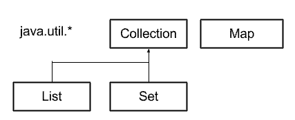

# Threads

- A JVM faz automaticamente o uso de threads para coletar objetos abandonados na memória. Essas threads (que na verdade são várias) chamamos de Garbage Collector (que traduzido do inglês, significa "coletor de lixo" ou "lixeiro"). Ele é responsável por jogar fora todos os objetos que não estão sendo referenciados por nenhum outro objeto.

### Em relação as threads
- Não é possível determinar a ordem de execução, que pode ser sempre diferente inclusive na mesma máquina.

- Vimos na aula que a JVM mapeia as threads java para threads nativas do sistema:


- E se o sistema operacional por baixo não desse suporte ao multi-threading nativo? Aí entram as threads que também se chamam de Green Threads. Nesse caso a JVM simularia um ambiente multi-threaded, mas na verdade só pode ter um processo ou thread executando ao mesmo tempo.

- Em outras palavras, as Green Threads emulam um ambientes multi-threaded, sem depender de quaisquer capacidades do sistema operacional nativo. As threads nativas realmente usam a capacidade nativa do sistema operacional para gerenciar processos multi-threaded.

> Como podemos pegar a instância da Thread atual (aquela que está sendo executada)?
- Thread atual = Thread.currentThread();
> Qual o nome do modificador que deve ser colocado em um método para que não possa ser executado por duas Threads ao mesmo tempo?
- synchronized
> O que é uma operação atômica?
- Cuja execução não pode ser interrompida na metade.

- Para quem já trabalhou com banco de dados e usou transações sabe que exatamente isso é uma das caraterísticas delas. Transações possuem as caraterísticas ACID que vão além da funcionalidade syncronized:

- A de Atômico (é isso que syncronized faz)
- C de Consistente
- I de Isolado
- D de Durável

- O método synchronized(), que é baseado em uma chave (this), que também é chamada de **Mutex**. Cada objeto no mundo Java já possui essa chave para sincronizar o acesso. Dessa forma, o thread é executado continuadamente, sem nunca liberar a chave e travando a aplicação.


### ReentrantLock

```
public class Banheiro {

    private Lock lock = new ReentrantLock();

    public void fazNumero1() {

        lock.lock();
            System.out.println("entrando no banheiro");
            System.out.println("fazendo coisa rapida");

            try {
                Thread.sleep(8000);
            } catch (InterruptedException e) {
                e.printStackTrace();
            }

            System.out.println("dando descarga");
            System.out.println("lavando a mao");
            System.out.println("saindo do banheiro");
        lock.unlock();
    }

    public void fazNumero2() {

        lock.lock();
            System.out.println("entrando no banheiro");
            System.out.println("fazendo coisa demorada");

            try {
                Thread.sleep(15000);
            } catch (InterruptedException e) {
                e.printStackTrace();
            }

            System.out.println("dando descarga");
            System.out.println("lavando a mao");
            System.out.println("saindo do banheiro");
        lock.unlock();
    }
}
```
- Certamente há algumas diferenças que podemos examinar. Uma das principais é a possibilidade de se criar um lock com timeout usando uma sobrecarga do método tryLock.

- Por exemplo:
	- boolean locked = lock.tryLock(5, TimeUnit.SECONDS); //5s

- Com esse método esperamos até cinco segundos e receberemos true caso o lock for obtido. Caso contrário, receberemos false. Como desvantagem, há o fato de o programador ter a responsabilidade de liberar o lock (unlock()).


> Marque as afirmativas verdadeiras sobre a classe java.util.Vector?
	- É thread-safe.
	- É uma lista, implementa a interface java.util.List.
	

- Vimos na aula a classe java.util.Vector em ação, mas a API de Collections possuem muito mais interfaces e implementações.

- Dentro dessa API existem 4 interfaces principais: java.util.Collection, java.util.List, java.util.Set e java.util.Map.





- Se a classe Vector é a versão thread-safe de uma lista, será que existem para as outras interfaces implementações thread-safe? Claro que sim!

- Para os mapas (Map) podemos usar a antiga classe Hashtable:

- Map mapaThreadSafe = new Hashtable();COPIAR CÓDIGO
E também temos uma implementação mais recente e performática de mapas, a classe ConcurrentHashMap:

- //do pacote java.util.concurrent
```
Map mapaThreadSafe = new ConcurrentHashMap();COPIAR CÓDIGO
```
- Para o Set (conjunto) não existe uma implementação pronta na API padrão do Java mas podemos utilizar a classe Collections para construir um Set sincronizado:

```
Set conjunto = Collections.synchronizedSet(new HashSet());
```

### Estado da Thread

> Qual é o nome de estado que a thread ficou ao chamar this.wait()?
- WAITING

- O interessante é que todas as alternativas realmente representam um possível estado de uma thread. Vamos ver ainda alguns acontecendo nesse curso, mas segue uma breve explicação de cada:

	- NEW Uma thread foi criada mas ainda não foi iniciada.
	- RUNNABLE A thread está rodando dentro da JVM.
	- BLOCKED A thread foi bloqueada pois não conseguiu pegar a chave.
	- WAITING A thread está esperando pois foi chamado this.wait().
	- TIMED_WAITING A thread está esperando pois foi chamado this.wait(milis).
	- TERMINATED A thread está finalizada.

> Como fazer com que uma thread A espere a execução da thread B?
- Coloque um wait() na Thread A e um notify() na Thread B.

> Em que classe estão definidos os métodos wait() e notify()?
- Object


### Daemon
- Uma thread daemon é uma prestadora de serviços para outras threads. Ela só é usada enquanto as outras threads estão rodando.

- Threads daemon são como prestadores de serviços para outras threads. Elas são usadas para dar apoio à tarefas e só são necessárias rodar quando as threads "normais" ainda estão sendo executadas. Uma thread daemon não impede a JVM de terminar desde que não existem mais threads principais em execução. Um exemplo de uma thread daemon é o coletor de lixo da JVM (Garbage Collector).

### Prioridades
- Vimos que podemos coordenar a execução de threads, mas quando uma thread realmente executa continuamos não sabendo. Também não sabemos, quando tem mais de uma thread esperando, qual thread realmente continua executando em caso de notificação. Tudo isso é fora do poder do nosso programa e depende do escalonador de threads.

- Aí pode vir uma dúvida: Falamos rapidamente que a coleta de lixo (Garbage Collection) é executada em uma ou mais threads dentro da JVM. Quando há pouca memória disponível, será que não faz sentido dar o máximo de tempo para essa thread? No final, o trabalho dele possibilita o bom funcionamento da JVM!

- A mesma pergunta podemos fazer para a nossa thread de limpeza: Será que não faz sentido dar preferência à limpeza quando tem muitos convidados, sabendo que cada convidado quer um banheiro limpo?

- Faz todo sentido e podemos dar uma dica para o escalonador, definindo que há threads com uma prioridade maior do que outras. Isso é apenas uma dica e não temos garantias, mas muito provável que o escalonador respeite a dica.

- Na classe Thread existe um método setPriority com justamente esse propósito. A prioridade é um valor inteiro entre 1 e 10, sendo 10 a prioridade mais alta. Basta usar o método:

```
Thread limpeza = new Thread(new TarefaLimpeza(banheiro), "Limpeza");
limpeza.setPriority(10);
limpeza.start();
```

- Em vez de usar um integer diretamente podemos aproveitar alguns constantes criados na classe Thread, por exemplo:

```
limpeza.setPriority(Thread.MAX_PRIORITY);
```
- ou

```
limpeza.setPriority(Thread.MIN_PRIORITY);
```
- E já vem mais uma pergunta: Qual é a prioridade padrão de uma thread? Tente descobrir (ou clique em continuar) :)


- Até agora não usamos nada de prioridade no nosso código. Qual é a prioridade padrão de uma thread?

- Na classe Thread temos um atributo público e estático que define a prioridade padrão (NORM_PRIORITY):

```
   /**
     * The default priority that is assigned to a thread.
     */
    public final static int NORM_PRIORITY = 5;
```
- Isso significa que se não usamos nenhuma prioridade explícita, a thread vai assumir o valor 5 para a prioridade.


