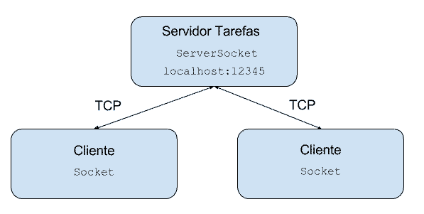

# Threads em Java 2: programação concorrente avançada

- [O projeto Servidor de tarefas](#anc1)
- [Reuso de threads](#anc2)
- [Melhorando o cliente](#anc3)
- [Entendendo Volatile](#anc4)
- [Distribuindo comandos e tratamento de erro](#anc5)
- [Retornos no Futuro](#anc6)
- [Produzindo e Consumindo com Threads](#anc7)


## O projeto Servidor de tarefas

<a name="anc1"></a>

- Nele veremos as classes e interfaces principais do pacote java.util.concurrent

### O projeto Servidor de tarefas

- Para continuarmos a aprender mais sobre as threads da JVM, escolhemos um projeto prático onde introduzimos passo a passo novos recursos sobre threads. O objetivo é criar um servidor onde podemos submeter tarefas a executar. O servidor pode ou não confirmar o recebimento das tarefas e, claro, deve executá-las em paralelo. 


### Socket e TCP/IP
- Por conta da necessidade de dois computadores se comunicarem, surgiram diversos protocolos que permitissem tal troca de informação. O protocolo que vamos usar aqui é o TCP (Transmission Control Protocol*).

- Através do TCP, é possível criar um fluxo entre dois ou mais computadores - como é mostrado no diagrama abaixo:

É possível conectar mais de um cliente ao mesmo servidor, como é o caso de diversos banco de dados, servidores web, servidores de e-mail ou ftp, etc.

Ao escrever um programa em Java que se comunique com outra aplicação, não é necessário se preocupar com um nível tão baixo quanto o protocolo. As classes que trabalham com eles já foram disponibilizadas para serem usadas por nós no pacote java.net.

A vantagem de se usar o TCP, em vez de criar nosso próprio protocolo de bytes, é que o TCP vai garantir a entrega dos pacotes que transferimos e criar um protocolo base para isto é algo bem complicado.

Por outro lado, o TCP não é um protocolo de aplicação e sim de transporte. Isso significa que não é preciso se preocupar em como os dados serão transmitidos. O TCP garante que os dados serão transmitidos de maneira confiável, mas não se preocupa com o significado desses dados.

Isso é tarefa do protocolo de aplicação. Através dele, dependendo do protocolo, como o HTTP ou o FTP, podemos então definir que queremos acessar um arquivo no servidor, enviar parâmetros de pesquisa ou submeter dados de um formulário.

Em outras palavras, o TCP garante que os dados são transmitidos e o protocolo de aplicação define o significado desses dados.

Abrindo Portas
Nosso objetivo é estabelecer uma conexão e já mencionamos que diversos clientes podem se conectar a um só servidor. Cada cliente vai manter uma conexão com o servidor, mas como o servidor saberá distinguir entre os clientes?

Assim como existe o IP para identificar uma máquina, a porta é a solução para identificar diversos clientes em uma máquina. Esta porta é um número de 2 bytes, varia de 0 a 65535. Se todas as portas de uma máquina estiverem ocupadas, não é possível se conectar a ela enquanto nenhuma for liberada. Então, além do IP, também é preciso saber a porta!

O que é um Socket?
Já sabemos que vamos utilizar o TCP e que precisamos do IP da máquina servidora e a porta. Todos esses detalhes do protocolo são abstraídos no mundo Java através de um socket. Um socket é o ponto-final de um fluxo de comunicação entre duas aplicações, através de uma rede. É exatamente isso que estamos procurando!



> Vimos como aceitar um cliente através de um ServerSocket.
```
ServerSocket servidor = new ServerSocket(12345);
Socket socket = servidor.accept();COPIAR CÓDIGO
```
- O que podemos dizer sobre o método accept()?

	- É bloqueante e trava a thread.
	
	


## Reuso de threads

<a name="anc2"></a>
