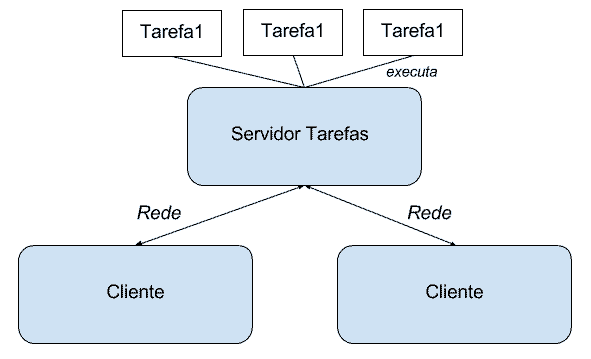
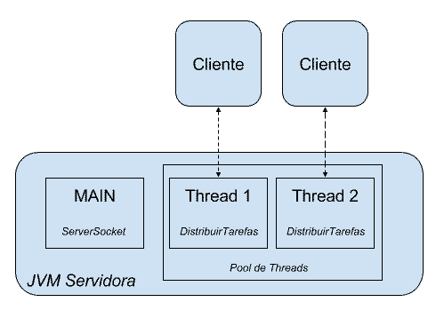
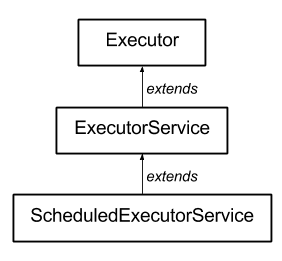

# Threads em Java 2: programação concorrente avançada

- [O projeto Servidor de tarefas](#anc1)
- [Reuso de threads](#anc2)
- [Melhorando o cliente](#anc3)
- [Entendendo Volatile](#anc4)
- [Distribuindo comandos e tratamento de erro](#anc5)
- [Retornos no Futuro](#anc6)
- [Produzindo e Consumindo com Threads](#anc7)


## O projeto Servidor de tarefas

<a name="anc1"></a>

- Nele veremos as classes e interfaces principais do pacote java.util.concurrent

### O projeto Servidor de tarefas

- Para continuarmos a aprender mais sobre as threads da JVM, escolhemos um projeto prático onde introduzimos passo a passo novos recursos sobre threads. O objetivo é criar um servidor onde podemos submeter tarefas a executar. O servidor pode ou não confirmar o recebimento das tarefas e, claro, deve executá-las em paralelo. 



### Socket e TCP/IP
- Por conta da necessidade de dois computadores se comunicarem, surgiram diversos protocolos que permitissem tal troca de informação. O protocolo que vamos usar aqui é o TCP (Transmission Control Protocol*).

- Através do TCP, é possível criar um fluxo entre dois ou mais computadores - como é mostrado no diagrama abaixo:

É possível conectar mais de um cliente ao mesmo servidor, como é o caso de diversos banco de dados, servidores web, servidores de e-mail ou ftp, etc.

Ao escrever um programa em Java que se comunique com outra aplicação, não é necessário se preocupar com um nível tão baixo quanto o protocolo. As classes que trabalham com eles já foram disponibilizadas para serem usadas por nós no pacote java.net.

A vantagem de se usar o TCP, em vez de criar nosso próprio protocolo de bytes, é que o TCP vai garantir a entrega dos pacotes que transferimos e criar um protocolo base para isto é algo bem complicado.

Por outro lado, o TCP não é um protocolo de aplicação e sim de transporte. Isso significa que não é preciso se preocupar em como os dados serão transmitidos. O TCP garante que os dados serão transmitidos de maneira confiável, mas não se preocupa com o significado desses dados.

Isso é tarefa do protocolo de aplicação. Através dele, dependendo do protocolo, como o HTTP ou o FTP, podemos então definir que queremos acessar um arquivo no servidor, enviar parâmetros de pesquisa ou submeter dados de um formulário.

Em outras palavras, o TCP garante que os dados são transmitidos e o protocolo de aplicação define o significado desses dados.

Abrindo Portas
Nosso objetivo é estabelecer uma conexão e já mencionamos que diversos clientes podem se conectar a um só servidor. Cada cliente vai manter uma conexão com o servidor, mas como o servidor saberá distinguir entre os clientes?

Assim como existe o IP para identificar uma máquina, a porta é a solução para identificar diversos clientes em uma máquina. Esta porta é um número de 2 bytes, varia de 0 a 65535. Se todas as portas de uma máquina estiverem ocupadas, não é possível se conectar a ela enquanto nenhuma for liberada. Então, além do IP, também é preciso saber a porta!

O que é um Socket?
Já sabemos que vamos utilizar o TCP e que precisamos do IP da máquina servidora e a porta. Todos esses detalhes do protocolo são abstraídos no mundo Java através de um socket. Um socket é o ponto-final de um fluxo de comunicação entre duas aplicações, através de uma rede. É exatamente isso que estamos procurando!


> Vimos como aceitar um cliente através de um ServerSocket.
```
ServerSocket servidor = new ServerSocket(12345);
Socket socket = servidor.accept();COPIAR CÓDIGO
```
- O que podemos dizer sobre o método accept()?

	- É bloqueante e trava a thread.	


## Reuso de threads

<a name="anc2"></a>


### Reaproveitando threads

- Já estabelecemos uma conexão entre cliente e servidor. A implementação é ainda bem simples, mas à medida que avançarmos no treinamento, vamos introduzir mais complexidade.

- O nosso foco neste treinamento na verdade não são os sockets, mas sim as threads! Criamos esse exemplo para ter uma aplicação real e poder aplicar novos recursos sobre threads. E é exatamente isso que vamos fazer agora.

- Reparem que criamos para cada novo cliente, uma nova thread dedicada. Se temos 10 clientes, vamos ter 10 threads, proporcionalmente. Como aprendemos, uma thread é mapeada para uma thread nativa do sistema operacional. Isso tem o seu custo, nós sempre devemos ter cuidado e pensar antecipadamente quantas threads a nossa aplicação pode criar para melhorar o uso dos recursos.

- Felizmente o Java já vem preparado para reaproveitar as threads através de um pool. Um pool nada mais é do que um gerenciador de objetos. Ele possui um limite de objetos que podemos estabelecer. Além disso, podemos reaproveitar esses objetos! Quem conhece um pool de conexões do mundo de banco de dados, é exatamente isso que queremos utilizar para o mundo de threads.

- Para usar um pool de threads, devemos utilizar a classe Executors. Ela possui vários métodos estáticos para criar o pool específico. No exemplo, através do método newFixedThreadPool criaremos um pool com uma quantidade de threads pré-definidas:

```
ExecutorService poolDeThreads = Executors.newFixedThreadPool(5); 
```

### Testando o ExecutorService
- Através do nosso ExecutorService podemos atender no máximo 2 clientes. Se precisarmos de mais uma thread, o service bloqueia a execução e espera até que um outro cliente devolva uma thread.

- Quando rodarmos o nosso servidor e conectarmos mais de dois clientes, repare que o terceiro cliente fica bloqueado e a saída não aparece no console do servidor.

- Como já falamos, quando não sabemos direito qual é o valor máximo ideal de threads, podemos utilizar o CachedThreadPool:

```
ExecutorService threadPool = Executors.newCachedThreadPool();
```


> Um pool de threads é um gerenciador de objetos do tipo Thread. Ele gerencia uma quantidade de threads estabelecida, que fica aguardando por tarefas fornecidas pelos clientes. A sua grande vantagem é que além de controlarmos a quantidade de threads disponível para uso dos clientes, também podemos fazer o reuso de threads por clientes diferentes, não tendo o gasto de CPU de criar uma nova thread para cada cliente que chega no servidor.

### Tipos de pool's de threads 
- A **newFixedThreadPool** é o pool de threads em que definimos previamente a quantidade de threads que queremos utilizar. Assim, se por exemplo estabelecermos que queremos no máximo 4 threads, este número nunca será extrapolado e elas serão reaproveitadas.

- A **newCachedThreadPool** é o pool de threads que cresce dinamicamente de acordo com as solicitações. É ideal quando não sabemos o número exato de quantas threads vamos precisar. O legal deste pool é que ele também diminuí a quantidade de threads disponíveis quando uma thread fica ociosa por mais de 60 segundos.

- A **newSingleThreadExecutor** é o pool de threads que só permite uma única thread.

### As interfaces do Pool de threads
- Todas as implementações tem em comum que eles implementam a mesma interface: [link do JavaDoc](https://docs.oracle.com/javase/10/docs/api/java/util/concurrent/ExecutorService.html)

- interface ExecutorService estende a interface Executor.

- Existe mais uma interface, a ScheduledExecutorService que por sua vez estende o ExecutorService.



- Também temos uma implementação dela já pronta para usar:

```
Runnable tarefa = ....;
ScheduledExecutorService pool = Executors.newScheduledThreadPool(4);
```
- Através desse pool podemos agendar e executar uma tarefa periodicamente, por exemplo:

```
pool.scheduleAtFixedRate(tarefa, 0, 60, TimeUnit.MINUTES); 
```
- executamos uma tarefa a cada 60 minutos

## Melhorando o cliente

<a name="anc3"></a>

## Entendendo Volatile

<a name="anc4"></a>


## Distribuindo comandos e tratamento de erro

<a name="anc5"></a>

## Retornos no Futuro

<a name="anc6"></a>

## Produzindo e Consumindo com Threads

<a name="anc7"></a>