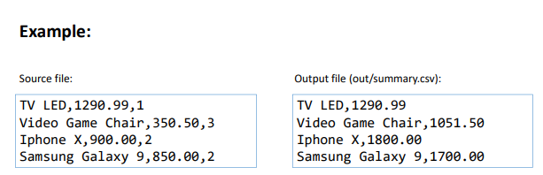

## Trabalhando com Arquivos

- Projeto **Trabalhando_com_arquivos**

### Referências
- [File - Representação abstrata de um arquivo e seu caminho](https://docs.oracle.com/javase/10/docs/api/java/io/File.html)
- [Scanner - Leitor de texto](https://docs.oracle.com/javase/10/docs/api/java/util/Scanner.html)
- [IOException (Exception)](https://docs.oracle.com/javase/10/docs/api/java/io/IOException.html)

```
package application;
import java.io.File;
import java.io.IOException;
import java.util.Scanner;
public class Program {
	public static void main(String[] args) {
		File file = new File("C:\\temp\\in.txt");
		Scanner sc = null;
		try {
			sc = new Scanner(file);
			while (sc.hasNextLine()) {
				System.out.println(sc.nextLine());
			}
		}
		catch (IOException e) {
			System.out.println("Error: " + e.getMessage());
		}
		finally {
			if (sc != null) {
				sc.close();
			}
		}
	}
}
```

### FileReader e BufferedReader

- [FileReader (stream de leitura de caracteres a partir de arquivos)](https://docs.oracle.com/javase/10/docs/api/java/io/FileReader.html)
- [BufferedReader (mais rápido)](https://docs.oracle.com/javase/10/docs/api/java/io/BufferedReader.html)
- [BufferedReader (mais rápido)](https://stackoverflow.com/questions/9648811/specific-difference-betweenbufferedreader-and-filereader)

```
package application;
import java.io.BufferedReader;
import java.io.FileReader;
import java.io.IOException;
public class Program {
	public static void main(String[] args) {
		String path = "C:\\temp\\in.txt";

		BufferedReader br = null;
		FileReader fr = null;
		try {
			fr = new FileReader(path);
			br = new BufferedReader(fr);
			String line = br.readLine();
			while (line != null) {
				System.out.println(line);
				line = br.readLine();
			}
		} catch (IOException e) {
			System.out.println("Error: " + e.getMessage());
		} finally {
			try {
				if (br != null)
					br.close();
				if (fr != null)
					fr.close();
			} catch (IOException e) {
					e.printStackTrace();
			}
		}
	}
}
```
- É um bloco try que declara um ou mais recursos, e garante que esses recursos serão fechados ao final do bloco
- [Disponível no Java 7 em diante](https://docs.oracle.com/javase/tutorial/essential/exceptions/tryResourceClose.html)

### Bloco try-with-resources

```
package application;
import java.io.BufferedReader;
import java.io.FileReader;
import java.io.IOException;
public class Program {
	public static void main(String[] args) {
		String path = "C:\\temp\\in.txt";

		try (BufferedReader br = new BufferedReader(new FileReader(path))) {
			String line = br.readLine();
			while (line != null) {
				System.out.println(line);
				line = br.readLine();
			}
		} catch (IOException e) {
			System.out.println("Error: " + e.getMessage());
		}
	}
}
```
### FileWriter e BufferedWriter

- [FileWriter (stream de escrita de caracteres em de arquivos)](https://docs.oracle.com/javase/10/docs/api/java/io/FileWriter.html)
	- Cria/recria o arquivo: new FileWriter(path)
	- Acrescenta ao arquivo existente: new FileWriter(path, true)
- [BufferedWriter (mais rápido)](https://docs.oracle.com/javase/10/docs/api/java/io/BufferedWriter.html)

```
package application;
import java.io.BufferedWriter;
import java.io.FileWriter;
import java.io.IOException;
public class Program {
	public static void main(String[] args) {
		String[] lines = new String[] { "Good morning", "Good afternoon", "Good night" };

		String path = "C:\\temp\\out.txt";
		try (BufferedWriter bw = new BufferedWriter(new FileWriter(path))) {
			for (String line : lines) {
				bw.write(line);
				bw.newLine();
			}
		} catch (IOException e) {
			e.printStackTrace();
		}
	}
}
```

### Manipulando pastas com File
```
package application;
import java.io.File;
import java.util.Scanner;
public class Program {
	public static void main(String[] args) {
		Scanner sc = new Scanner(System.in);

		System.out.println("Enter a folder path: ");
		String strPath = sc.nextLine();

		File path = new File(strPath);

		File[] folders = path.listFiles(File::isDirectory);
		System.out.println("FOLDERS:");
		for (File folder : folders) {
			System.out.println(folder);
		}
		File[] files = path.listFiles(File::isFile);
		System.out.println("FILES:");
		for (File file : files) {
			System.out.println(file);
		}
		boolean success = new File(strPath + "\\subdir").mkdir();
		System.out.println("Directory created successfully: " + success);

		sc.close();
	}
}
```

### Informações do caminho do arquivo
```
package application;
import java.io.File;
import java.util.Scanner;
public class Program {
	public static void main(String[] args) {

		Scanner sc = new Scanner(System.in);

		System.out.println("Enter a folder path: ");
		String strPath = sc.nextLine();

		File path = new File(strPath);
		System.out.println("getPath: " 
		+ path.getPath());
		System.out.println("getParent: " + path.getParent());
		System.out.println("getName: " + path.getName());

		sc.close();
	}
}
```

#### Exercício proposto
- Fazer um programa para ler o caminho de um arquivo .csv contendo os dados de itens vendidos. Cada item possui um nome, preço unitário e quantidade, separados por vírgula. Você deve gerar um novo arquivo chamado "summary.csv", localizado em uma subpasta chamada "out" a partir da pasta original do arquivo de origem, contendo apenas o nome e o valor total para aquele item (preço unitário multiplicado pela quantidade), conforme exemplo.

- Projeto Exer11_trabalhandoComArquivos


