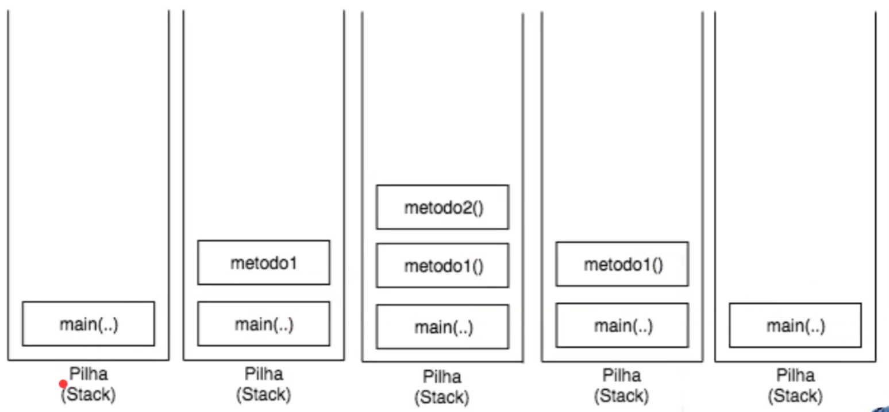

## Java Exceções: aprenda a criar, lançar e controlar exceções

- [Pilha de execução Ver primeiro vídeo](#anc1)
- [Tratamento de exceções](#anc2)
- [Lançando exceções](#anc3)
- [Checked e Unchecked](#anc4)
- [Aplicando exceções](#anc5)
- [Finally e try with resources](#anc6)


<a name="anc1"></a>

## Pilha de execução Ver primeiro vídeo
- Aula01



> Por que a JVM usa um Stack?
- Para saber qual método está sendo executado
- Para organizar a execução dos métodos


<a name="anc2"></a>

## Tratamento de exceções

### Exceções: O que são e para que servem?
- As exceções são problemas que acontecem na hora de compilar o código. Considerando que existe uma variedade imensa, elas possuem nomes explicativos e, às vezes, mostram claramente o motivo de seu surgimento, facilitando a identificação delas.


- Para acessibilidade: Podemos imaginar a pilha de execução, como um copo que recebe várias camadas, chamadas de métodos. A ordem de surgimento delas está de acordo com o método que é chamado. Como todo método é chamado a partir da main(), ele sempre estará no fundo do copo, pois é sempre o primeiro.

- A main(), por sua vez, chama o metodo1(), que chamará o metodo2(). Como o metodo2() foi o último a ser chamado, ele está no topo do copo. A bomba (exceção) cai no metodo2() e, como ele não tem nenhum bloco de código que possa tratar essa bomba, o metodo2() sai do copo, e cai na função anterior, ou seja, no metodo1().

- Por sua vez, o metodo1() também não possui o bloco de código para tratar essa exceção, e por isso, o método sai da pilha, transferindo a exceção para main(); que assim como os anteriores, não possui o tratamento para a exceção, sendo obrigada a sair da pilha de execução, que será jogada no console.


> Toda exceção em Java possui um nome que a identifica. Essa abordagem torna seu entendimento mais fácil do que o uso de números mágicos (códigos de erros) como 15, 7012 ou 16.

> Exceções não tratadas caem na pilha de execução procurando por alguém que saiba lidar com ela.

#### Try catch
- Para tratarmos uma exceção, que pode ocorrer enquanto nosso programa esta sendo executado, precisamos tratá-la antecipadamente com um bloco de código específico.

- Não é possível ter uma instrução catch, sem uma instrução try.

#### A partir do Java 1.7, chegou mais uma variação do catch. Em vez de repetir vários blocos de catch, podemos colocar um pipe (|), que significa "OU":

```
catch(ArithmeticException | NullPointerException ex)
```


<a name="anc3"></a>

## Lançando exceções

<a name="anc4"></a>

## Checked e Unchecked

<a name="anc5"></a>

## Aplicando exceções

<a name="anc6"></a>

## Finally e try with resources