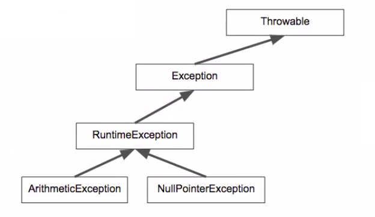
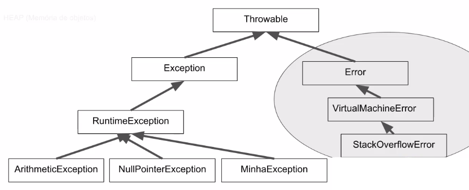
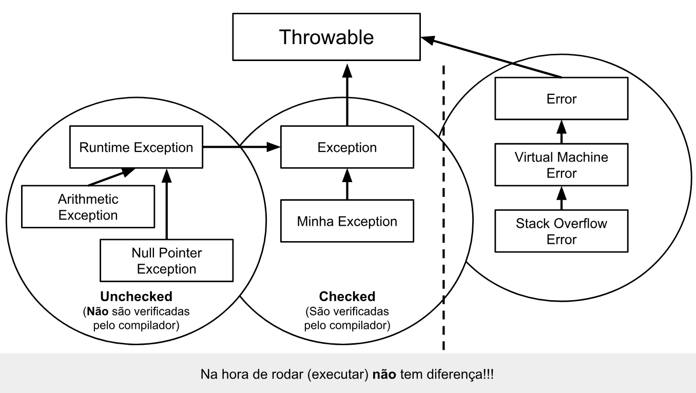

## Java Exceções: aprenda a criar, lançar e controlar exceções

- [Pilha de execução Ver primeiro vídeo](#anc1)
- [Tratamento de exceções](#anc2)
- [Lançando exceções](#anc3)
- [Checked e Unchecked](#anc4)
- [Aplicando exceções](#anc5)
- [Finally e try with resources](#anc6)


<a name="anc1"></a>

## Pilha de execução Ver primeiro vídeo
- Aula01


> Por que a JVM usa um Stack?
- Para saber qual método está sendo executado
- Para organizar a execução dos métodos


<a name="anc2"></a>

## Tratamento de exceções

### Exceções: O que são e para que servem?
- As exceções são problemas que acontecem na hora de compilar o código. Considerando que existe uma variedade imensa, elas possuem nomes explicativos e, às vezes, mostram claramente o motivo de seu surgimento, facilitando a identificação delas.


- Para acessibilidade: Podemos imaginar a pilha de execução, como um copo que recebe várias camadas, chamadas de métodos. A ordem de surgimento delas está de acordo com o método que é chamado. Como todo método é chamado a partir da main(), ele sempre estará no fundo do copo, pois é sempre o primeiro.

- A main(), por sua vez, chama o metodo1(), que chamará o metodo2(). Como o metodo2() foi o último a ser chamado, ele está no topo do copo. A bomba (exceção) cai no metodo2() e, como ele não tem nenhum bloco de código que possa tratar essa bomba, o metodo2() sai do copo, e cai na função anterior, ou seja, no metodo1().

- Por sua vez, o metodo1() também não possui o bloco de código para tratar essa exceção, e por isso, o método sai da pilha, transferindo a exceção para main(); que assim como os anteriores, não possui o tratamento para a exceção, sendo obrigada a sair da pilha de execução, que será jogada no console.


> Toda exceção em Java possui um nome que a identifica. Essa abordagem torna seu entendimento mais fácil do que o uso de números mágicos (códigos de erros) como 15, 7012 ou 16.

> Exceções não tratadas caem na pilha de execução procurando por alguém que saiba lidar com ela.

#### Try catch
- Para tratarmos uma exceção, que pode ocorrer enquanto nosso programa esta sendo executado, precisamos tratá-la antecipadamente com um bloco de código específico.

- Não é possível ter uma instrução catch, sem uma instrução try.

#### A partir do Java 1.7, chegou mais uma variação do catch. Em vez de repetir vários blocos de catch, podemos colocar um pipe (|), que significa "OU":

```
catch(ArithmeticException | NullPointerException ex)
```


<a name="anc3"></a>

## Lançando exceções
- Para lançar uma exceção, além de instanciá-la, é necessário lançá-la através do throw.
- Quando a exceção é lançada, o código para de executar abruptamente.
- Podemos atribuir uma mensagem à exceção.

```
private static void metodo2() {
    System.out.println("Ini do metodo2");
    throw new ArithmeticException("Deu erro");
}
```

<a name="anc4"></a>

## Checked e Unchecked
- A classe Throwable implementa a interface Serializable que se relaciona com o atributo serialVersionUID, mas esse não é o nosso foco.

- Ainda dentro de Throwable, encontramos o atributo detailMessage que especifica detalhes, as mensagens. Entretanto a classe Throwable é enorme, e nem tudo o que ela possui nos interessa. Por essa razão, para saber os membros dessa classe, utilizamos o atalho "Ctrl + O".

- Em uma janela mais enxuta, conseguimos então visualizar os seus membros, os métodos e atributos. E então, encontramos os métodos getMessage() e printStackTrace(). Ou seja, todos os métodos do mundo de exceções foram implementados na classe mãe Throwable.


- Para acessibilidade: A hierarquia abordada possui uma classe mãe Throwable está no topo do diagrama e, dela, é formada uma hierarquia de exceções voltada para o desenvolvedor/desenvolvedora Java.

- As classes ArithmeticException e NullPointerException herdam de RuntimeException, considerando que nessa classe só existem construtores, e ela herda de Exception que também só possui construtores. Exception é a última classe que herda de Throwable.

### Hierarquia dos erros.



- Para acessibilidade: A hierarquia abordada contém uma classe mãe chamada Throwable. A partir dela, formam-se duas categorias: uma para exceções onde o desenvolvedor pode gerenciar e uma outra categoria voltada para erros da máquina virtual.

- As exceções ArithmeticException, NullPointerException e MinhaException herdam de RuntimeException, que por sua vez, herda de Exception e Exception herda de Throwable, formando a primeira categoria de exceções. Já a segunda categoria de erros possui StackOverflowError, que herda de VirtualMachineError, que herda de Error, que herda de Throwable, formando a segunda categoria.



### Por que Checked e Unchecked?
- Na categoria Unchecked, o compilador não dá muita importância. Se dermos throws ou não, ele não toma atitude, ou seja, ele não verifica — unchecked (não verificado pelo compilador).

- Já a categoria Checked é verificada pelo compilador. No metodo2(), somos obrigados a colocar throws na assinatura do método, pois a exceção do tipo MinhaExcecao estende diretamente de Exception e, por isso, é verificada pelo compilador.

### Hierarquia
- Existe uma hierarquia grande de classes que representam exceções. Por exemplo, ArithmeticException é filha de RuntimeException, que herda de Exception, que por sua vez é filha da classe mais ancestral das exceções, Throwable. Conhecer bem essa hierarquia significa saber utilizar exceções em sua aplicação.
- Throwable é a classe que precisa ser extendida para que seja possível jogar um objeto na pilha (através da palavra reservada throw)
- É na classe Throwable que temos praticamente todo o código relacionado às exceções, inclusive getMessage() e printStackTrace(). Todo o resto da hierarquia apenas possui algumas sobrecargas de construtores para comunicar mensagens específicas
- A hierarquia iniciada com a classe Throwable é dividida em exceções e erros. Exceções são usadas em códigos de aplicação. Erros são usados exclusivamente pela máquina virtual.
- Classes que herdam de Error são usadas para comunicar erros na máquina virtual. Desenvolvedores de aplicação não devem criar erros que herdam de Error.
- StackOverflowError é um erro da máquina virtual para informar que a pilha de execução não tem mais memória.
- Exceções são separadas em duas grandes categorias: aquelas que são obrigatoriamente verificadas pelo compilador e as que não são verificadas.
As primeiras são denominadas checked e são criadas através do pertencimento a uma hierarquia que não passe por RuntimeException.
As segundas são as unchecked, e são criadas como descendentes de RuntimeException.

<a name="anc5"></a>

## Aplicando exceções
- À direita, temos erros que são da máquina virtual, nos quais não mexeremos, mas é importante saber que existem. À esquerda, temos as exceções.

- No mundo Java, não é correto falar sobre erros com desenvolvedores, considerando que trabalhamos com exceções, e os erros são da máquina virtual.

- O que nos interessa é o lado esquerdo do diagrama, referente às exceções. Vimos que existe diferença entre as exceções Checked e Unchecked, dependendo de qual classe estendemos. Se estendemos de RuntimeException, temos uma exceção do tipo Unchecked, ou seja, o compilador não toma atitude. Tendo throw ou não, ele não se importa.

- Se estendermos diretamente da classe Exception, o compilador ficará de olho e nos obrigará a colocar throws na assinatura do método, para sinalizar quem chama o método, que ele é perigoso ou tratar a exceção no próprio método com o try-catch. Essa exceção é do tipo checked.

- Na hora de executar o código, não tem diferença! Todos são como bombas que caem na pilha.




### Mas, para quê serve o Checked e o Unchecked?
- Essa é uma pergunta difícil, pois o significado de Checked e Unchecked para o nosso código, mudou durante a vida do Java.

- A polêmica das exceções está relacionada ao Checked. Hoje, existem aplicações que simplesmente não usam exceções desse tipo, e é muito comum utilizar bibliotecas que só têm exceções Unchecked, nas quais o compilador não nos obriga a tomar alguma atitude.

#### De que maneira as exceptions podem ajudar a melhorar o código de seu programa?

- Exceções tem um nome e, caso esse nome seja expressivo, documenta o problema que está ocorrendo.

- Exceções podem ter uma mensagem, ou seja, o problema e o estado das variáveis podem ser descritos na mensagem.

- Exceções mudam o fluxo de execução, ou seja, evitam que o problema siga o fluxo "normal" quando algo excepcional acontece.

- Exceções podem ser tratadas, ou seja, podemos voltar para a execução "normal" caso o "problema" esteja resolvido.

<a name="anc6"></a>

## Finally e try with resources

- Estudaremos mais alguns detalhes sobre try, catch e finally. Um try sozinho nunca é válido. Ele exige pelo menos um catch ou um finally!

- O código a seguir é válido, mesmo sem o catch:

```
Conexao con = null;
try {
    con = new Conexao();
    con.leDados();
} finally {
    con.fecha();
}
```

```
public class Conexao implements AutoCloseable {}
```
- Essa é uma interface, e a ideia das interfaces é definir um contrato e, caso você "assine" um contrato, será obrigado a implementar o método. Nesse caso, o método que somos obrigados a implementar da interface, é o método close().

Então, em vez de chamar o método fecha(), chamaremos close(). Vamos apagar o fecha() e mover a linha que imprime para o novo método:

```
public class Conexao implements AutoCloseable{
    public Conexao() {
        System.out.println("Abrindo conexao");
        throw new IllegalStateException();
    }

    public void leDados() {
        System.out.println("Recebendo dados");
        throw new IllegalStateException();
    }

    @Override
    public void close() {
        System.out.println("Fechando conexao");
    }
}
```

- O AutoCloseable exige que tenhamos o método close(), mas podemos deixar o método menos perigoso, retirando o throws Exception. Assim, simplificaremos um pouco o código e não será necessário mais um tratamento de erro para quem faz a chamada.

- Além disso, vamos focar no problema da conexão, na qual não há exceção na construção do objeto.

```
public Conexao() {
    System.out.println("Abrindo conexao");
    //throw new IllegalStateException();
}
```

### Veja as afirmações sobre o bloco finally:

- O bloco finally é opcional quando há bloco catch.

- O bloco finally sempre será executado (sem ou com exceção).

- O bloco finally é tipicamente utilizado para fechar um recurso como conexão ou transação.


#### O que está garantido quando usamos o try-with-resources?
```
try(Conexao con = new Conexao()) {
     con.leDados();
}
```
- O bloco finally é criado automaticamente.
- O recurso precisa implementar o método close().
